# Lab 0: Laborumgebung mit Containerlab

In dieser Übung wird gezeigt, wie der in den Vorbereitungen angelegte GitHub Codespace gestartet und gestoppt werden kann. 

Darüber hinaus wird das Basiswissen zum Umgang mit _Containerlab_ vermittelt:

- Anzeige und Aufbau der Containerlab Topology-Dateien
- Lab in Containerlab starten und stoppen
- Grafische Anzeige des in der Topology-Datei beschriebenen Labornetzwerkes mit Hilfe des eingebauten Topology Viewers
- Verbindung mit der Kommandzeile von PCs im Labornetzwerk
- Ausführen von Befehlen in der Kommandozeile eines Labornetz-PCs

  
  

/// caption
Lab Topology
///


file:///home/tom/Netzwerke/clab-lankurs/dokumentation/site/lab0.html#lab-0-laborumgebung-mit-containerlab_1

## VS Code starten und GitHub Sign-in

Um mit der Laborumgebung zu arbeiten, werden die installierten VS Code Extensions aus dem _Remote Development Pack_ genutzt um VS Code mit dem GitHub-Account des jeweilugen Kursteilnehers zu verbinden, damit der in den [Vorbereitungen](vorbereitungen.md#dev-container-in-github-codespaces-erstellen-und-starten) erstellte _Dev Container_ mit der _Containerlab_ Laborumgebung genutzt werden kann:

- VS Code auf dem Schulungs-Notebook bzw. Smart-Client starten 
- Im Menübalken am linken Rand den _Remote Explorer_ auswählen
- Über den Button `Sign in to GitHub` und die Eingabe des eigenen Usernames bzw. der E-Mail Adresse und des Passworts an GitHub anmelden
    * `Sign in to GitHub` Button auswählen
    * Den Dialog `The extension 'GitHub Codespaces' wants to sign in using GitHub._ über den `Allow`-Button bestätigen
    * Usernamen und Passwort eingeben und über den `Sign in`-Button bestätigen
    * Button `Continue` neben Usernamen auf Seite `Select user to authorize` auswählen
    * `Authorize Visual Studio Code`-Webseite über den Button `Authorize Visual-Studio-Code` bestätigen
    * Falls ein Dialog mit der Frage `https://vscode.dec erlauben, den vscode-Link mit dem System Handler zu öffen, den Haken für `...immer erlauben...` setzen und mit dem Button `Link öffnen` bestätigen
- Im VS Code Remote Explorer wird nun der Codespace des geforkten `clab-lankurs`-Repositries angezeigt

??? info "Screenshots: _VS Code GitHub Sign-in_"
    
    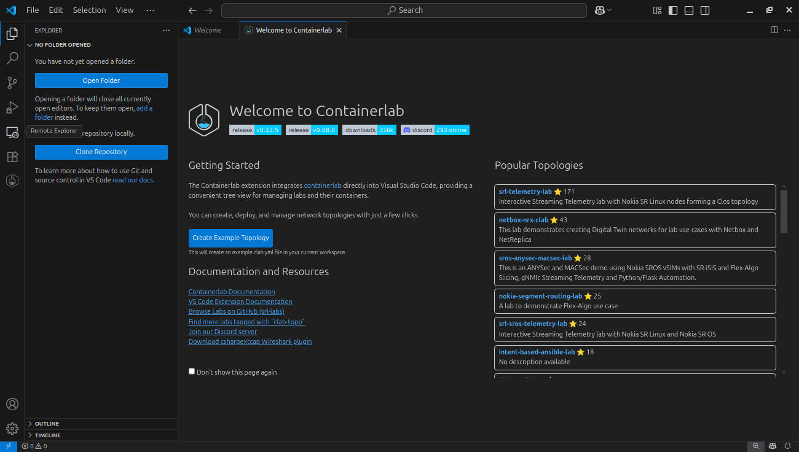
    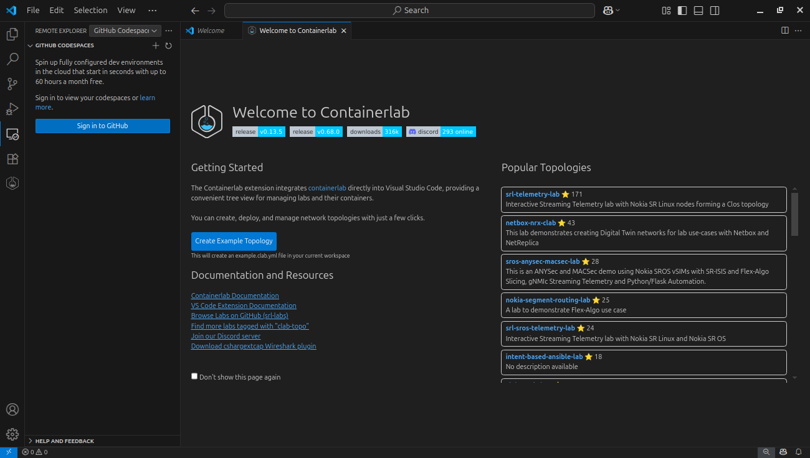
    
    
    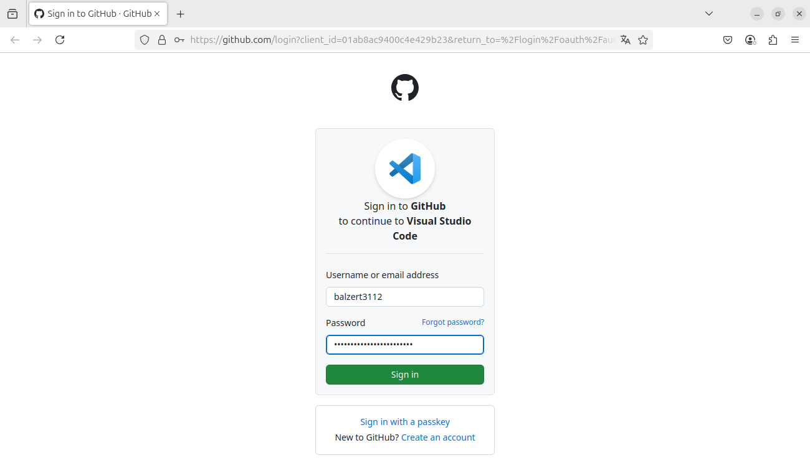
    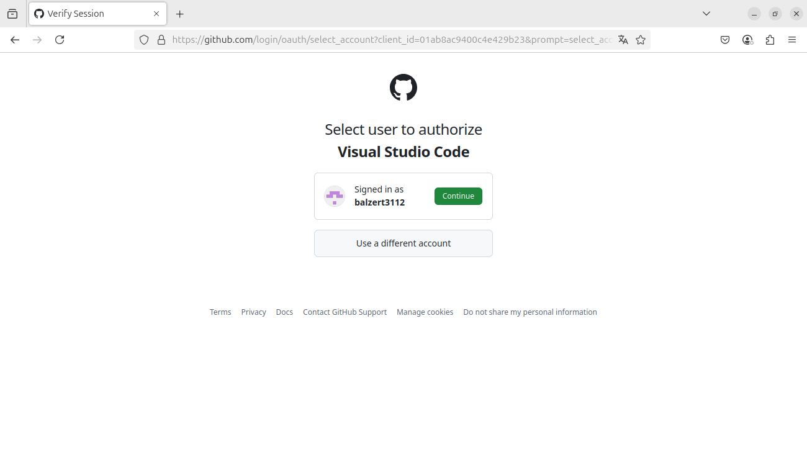
    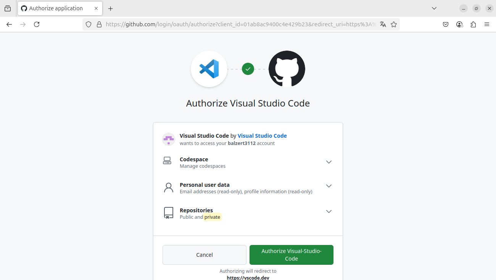
    
    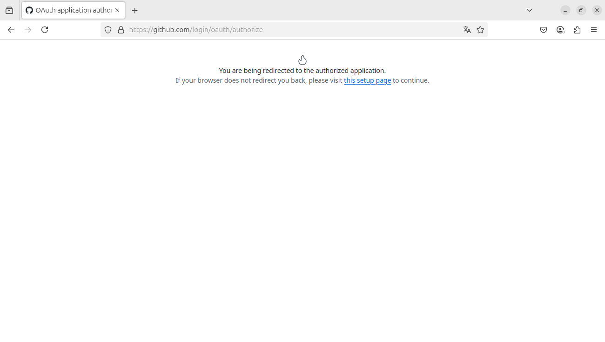
    

## Verbindung zu `clab-lankurs` Codespace herstellen

Nachdem der GitHub Sign-in erfolgreich war, kann die Verbindung von VS Code zum Codespace `clab-lankurs`, in welchem die Simulationsumgebung laufen wird, hergestellt werden (während dieses Vorgangs wird der Codespace Dev Container gestartet):

- Im _VS Code Remote Explorer_ mit der Maus den angezeigten GitHub Codespace `<DEIN_GITHUB_USER>/clab-lankurs/ <NAME_DEINES_DEV_CONTAINERS> main` auswählen
- _Dev Container_ über das _Steckersymbol_ `Connect to Codespace` rechts neben dem Namen des Codespaces starten und VS Code mit dem GitHub Codespace verbinden
- _Containerlab_ Laborumgebung startet und die VS Code _Containerlab Extension_ zeigt im VS Code _Explorer_ das Verzeichnis des `clab-lankurs`-Repositories an, dessen Dateien in die Laborumgebung im Codespace kopiert wurden und dort nun verwendet werden können

!!! note
    Die Steuerung der GitHub Codespace Simulationsumgebung mit Containerlab erfolgt über die [_Containerlab_ VS Code Extension](https://marketplace.visualstudio.com/items?itemName=srl-labs.vscode-containerlab). Die Details der Steuerung der Simulationsumgebung über _VS Code_ werden im Verlauf der Übungen schrittweise vorgestellt.

!!! note
    Der Reiter _Welcome to Containerlab_ wird nicht benötigt und kann bei Bedarf geschlossen werden (Tipp: Haken `Don't show this page again` setzen).

??? info "Screenshots: _VS Code mit Codespace des `clab-lankurs`-Repositories verbinden_ "
    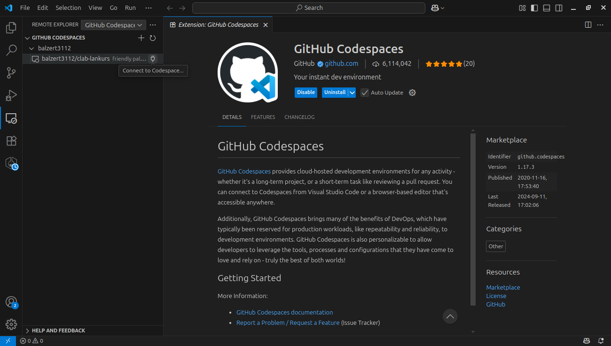
    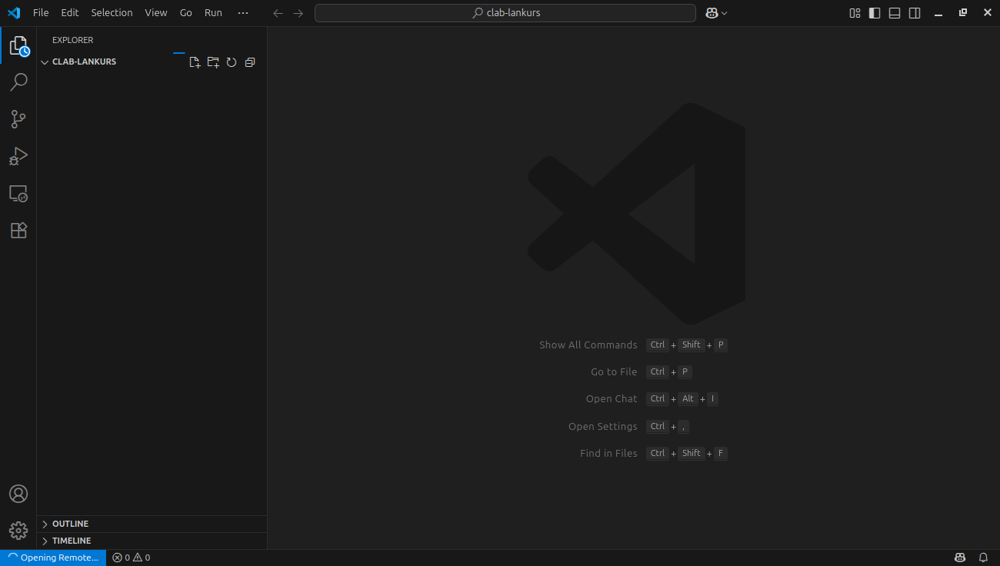
    
    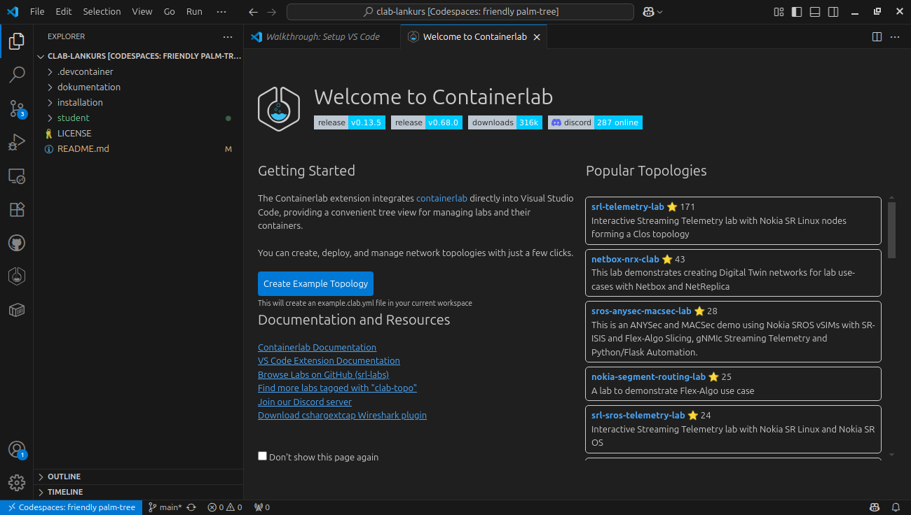


## Zugriff auf GitHub Docker Registry einrichten

!!! info
    Die für die nächsten Schritte benötigten Informationen `<YOUR_TOKEN>` und `<USERNAME>` erhalten die Schulungsteilnehmer auf drei Wegen:

    1. per E-Mail (für Smart Client Nutzer)
    2. in einer Datei auf dem Desktop des Schulungs-Notebooks (Teilnehmer ohne Smatz Client)
    3. über den Kursleiter (Fallback, falls 1. + 2. nicht verfügbar)

Für die Funktion der Labornetzwerke müssen nach dem ersten Start des Codespaces einmalig beim Start des ersten Labors noch einige Docker-Images
aus einer zentralen GitHub Docker-Registry geladen werden. Um dies zu ermöglichen, muss der Zugang zu wie folgt eingerichtet werden:

- In VS Code ein neues Terminal über da Menü `Terminal` und den Menüeintrag `New Terminal` öffnen
- Die folgende Schritte im Bereich `TERMINAL` des in VS Code Codespace eingeben:
    * Environment-Variable mit Zugriffstoken setzen (Platzhhalter <YOUR_TOKEN> mit dem erhaltenen GitHub-Token ersetzen)
    ```
    export CR_PAT=<YOUR_TOKEN>
    ```
    * Anmeldung an die GitHub Container Registry des GitHub-Users <USERNAME> (Platzhalter <USERNAME> mit GitHub Usernamen des Kursteilnehmers ersetzen)
    ```
    echo $CR_PAT | docker login ghcr.io -u <USERNAME> --password-stdin
    ```

??? info "Screenshots: _GitHub Docker Registry Login_"
    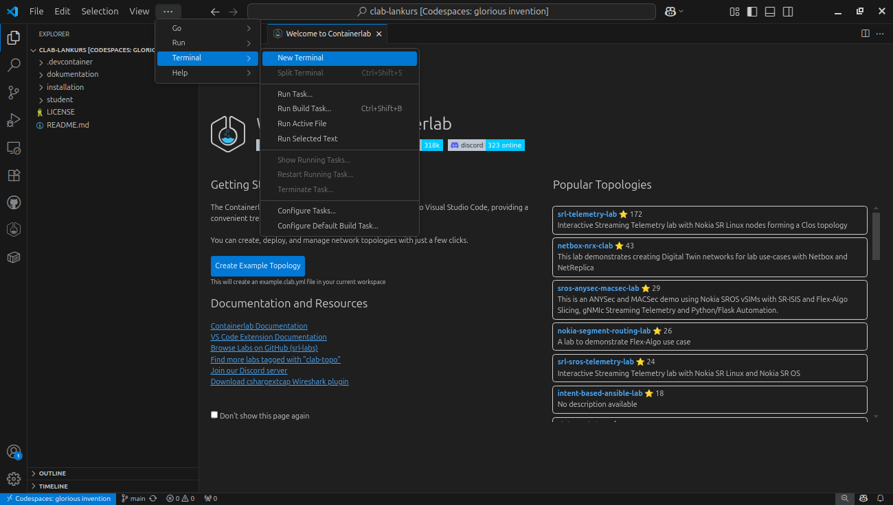
    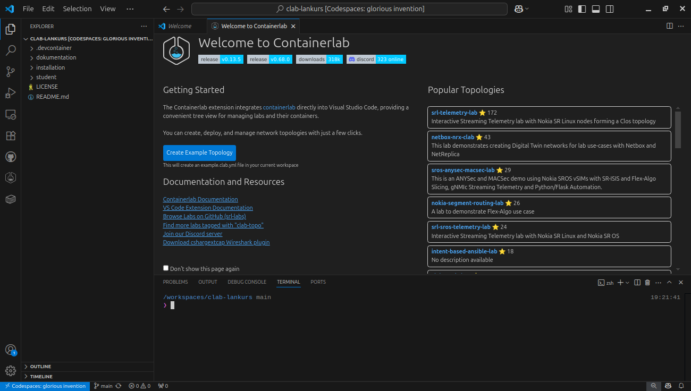
    
    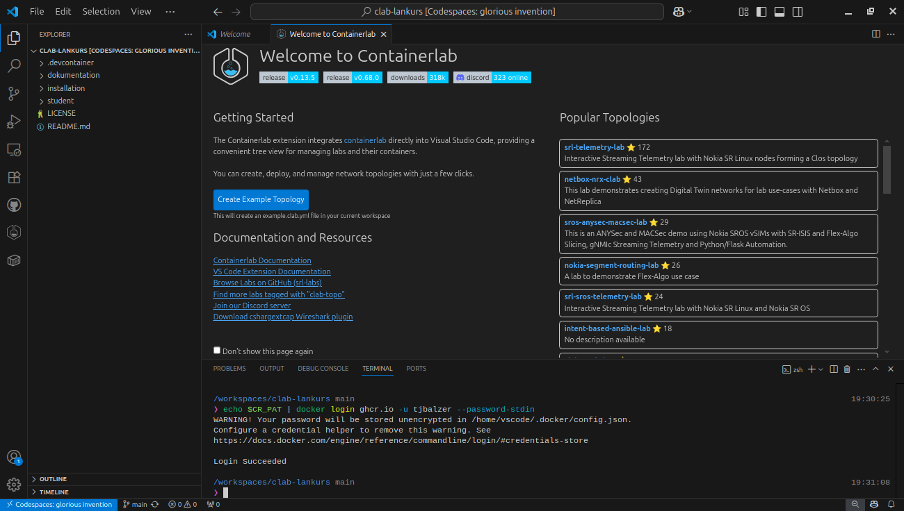

## Containerlab Topology Dateien anzeigen und ändern

- `EXPLORER`-Ansicht auswählen (Dateistruktur wird angezeigt)
- Die Dateien zu den einzelnen Übungen liegen im Verzeichnis `student` (Lab 1 bis 10)
- Bitte Verzeichnis `student/lab-2/` die Datei `topology.clab.yml` auswählen (Datei wird als Reiter `topology.clab.yml` im Editor-Bereich geöffnet)
- Bei Bedarf kann das Labornetzwerk über diese Datei konfiguriert werden (wird ggf. in künftigen Labs benötigt)
- Erklärungstexte für die einzelnen Bereiche können im folgenden Listing durch einen Klick auf die :material-plus-circle:-Symbole angezeigt werden

??? info "Screenshot: _Containerlab Toplogy Dateien anzeigen_"
    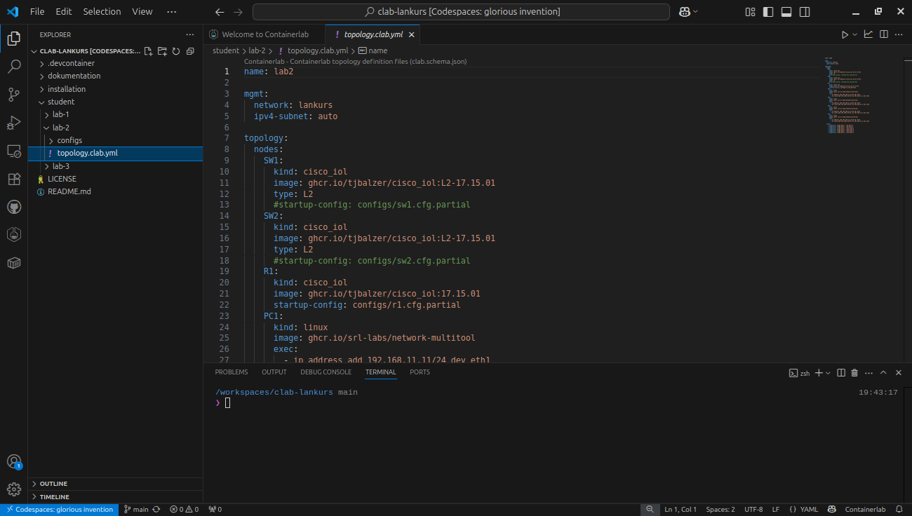


  ``` yaml title="student/lab-2/topology.clab.yml"
  name: lab2 # (1) 

  mgmt: # (2)
    network: lankurs # (3)
    ipv4-subnet: auto # (4)

  topology: # (5)
    nodes: # (6)
      SW1: # (7)
        kind: cisco_iol # (8)
        image: ghcr.io/tjbalzer/cisco_iol:L2-17.15.01 # (9)
        type: L2 # (10)
        #startup-config: configs/sw1.cfg.partial # (11)
      SW2:
        kind: cisco_iol
        image: ghcr.io/tjbalzer/cisco_iol:L2-17.15.01
        type: L2
        #startup-config: configs/sw2.cfg.partial
      R1:
        kind: cisco_iol
        image: ghcr.io/tjbalzer/cisco_iol:17.15.01
        startup-config: configs/r1.cfg.partial
      PC1:
        kind: linux
        image: ghcr.io/srl-labs/network-multitool
        exec: # (12)
          - ip address add 192.168.11.11/24 dev eth1 # (13)
          - ip route add 192.168.0.0/16 via 192.168.11.1 dev eth1 # (14)
      PC2:
        kind: linux
        image: ghcr.io/srl-labs/network-multitool
        exec:
          - ip address add 192.168.11.12/24 dev eth1 # (15)
          - ip route add 192.168.0.0/16 via 192.168.11.1 dev eth1 # (16)
      PC3:
        kind: linux
        image: ghcr.io/srl-labs/network-multitool
        exec:
          - ip address add 192.168.12.11/24 dev eth1 # (17)
          - ip route add 192.168.0.0/16 via 192.168.12.1 dev eth1 # (18)
      PC4:
        kind: linux
        image: ghcr.io/srl-labs/network-multitool
        exec:
          - ip address add 192.168.12.12/24 dev eth1 # (19)
          - ip route add 192.168.0.0/16 via 192.168.12.1 dev eth1 # (20)

    links: # (21)
      - endpoints: ["SW1:e0/1", "R1:e0/1"] # (22)
      - endpoints: ["SW2:e0/1", "R1:e0/2"]
      - endpoints: ["SW1:e0/2", "PC1:eth1"]
      - endpoints: ["SW1:e0/3", "PC2:eth1"]
      - endpoints: ["SW2:e0/2", "PC3:eth1"]
      - endpoints: ["SW2:e0/3", "PC4:eth1"]
  ```

  1. Name des Labors (ist Bestandteil des Gerätenames im Containerlab Labor)
  2. Management-Sektion: Konfiguration des Management Netzes
  3. Name des Management Netzwerks
  4. IPv4 Adressbereich des Management Netzwerks (hier: automatische Vergabe)
  5. Topology-Sektion: Beschreibung des Labornetzes (Netzwerk Nodes, verwendete Images, Konfiguration und Verbindungen)
  6. Nodes-Sektion: Beschreibung der Nodes
  7. Hostname des Nodes
  8. Kind/Typ des Nodes (z.B. `cisco_iol` oder `linux`)
  9. Name des zu verwendeten Container Image
  10. Typ (für einige Node Kinds, z.B. `cisco_iol` zur Auswahl des Layer 2 oder Layer 3 Images)
  11. Optionale Startkonfiguration für den Node (hier zur späteren Verwendung auskommentiert)
  12. Exec-Bereich für Docker-Container zur Übergabe von Befehlen, die beim Start des Containers ausgeführt werden
  13. Konfiguration der IP-Adresse von PC1
  14. Konfiguration des Default-Gateways von PC1
  15. Konfiguration der IP-Adresse von PC2
  16. Konfiguration des Default-Gateways von PC2
  17. Konfiguration der IP-Adresse von PC3
  18. Konfiguration des Default-Gateways von PC3
  19. Konfiguration der IP-Adresse von PC4
  20. Konfiguration des Default-Gateways von PC4
  21. Links-Sektion: Beschreibungd der Verbindungen zwischen den Containern
  22. Verbindung der Endpunkte SW1 Interface e0/1 nach R1 Interface eth1

## Lab: Labornetzwerk starten (Deploy)

- Containerlab-Bereich auswählen (über Containerlab Symbol)
- Im Bereich `UNDEPLOYED LOCAL LABS` das Verzeichnis `student/lab-2` öffnen
- Rechtsklick auf Datei `topology.clab.yml` und Start des Labors über Menüeintrag `Deploy`
- Optional: Im Informations-Dialog unten rechts `View Logs` klicken, danach kann man die Logmeldungen während des Starts im Bereich `OUTPUT` beobachten:
    * Fehlende Conatainer-Images werden aus der GitHub Docker Registry `ghcr.io` heruntergeladen und gespeichert
    * Labor Nodes werden gestartet und Verbindungen zwischen den Nodes etabliert
- Nach dem Start im Bereich `RUNNING LABS`:
    * Node Status wird farbig bzw. als `Up`/`Down` angezeigt
    * Status der einzelen Nodes durch _aufklappen_ des Labs angezeigt
- Alternativ kann die ausgewähle Topology Datei über die folgende Tastenkombination _deployed_ werden: ++ctrl+alt+d++

??? info "Screenshots: _Lab starten_"
    
    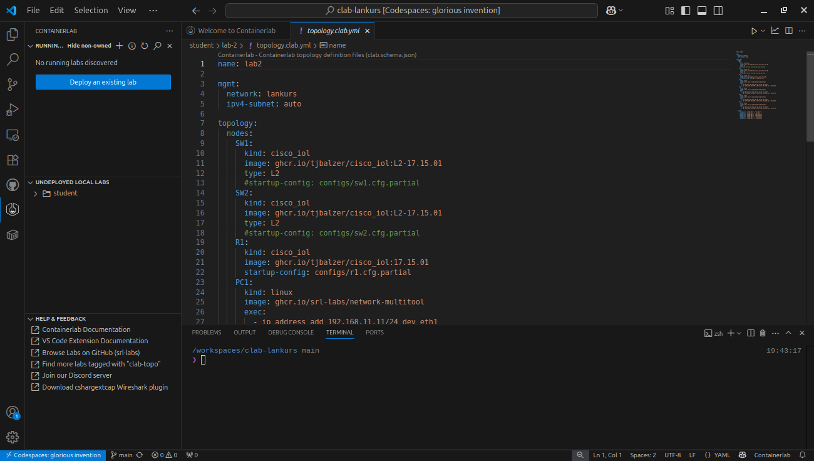
    
    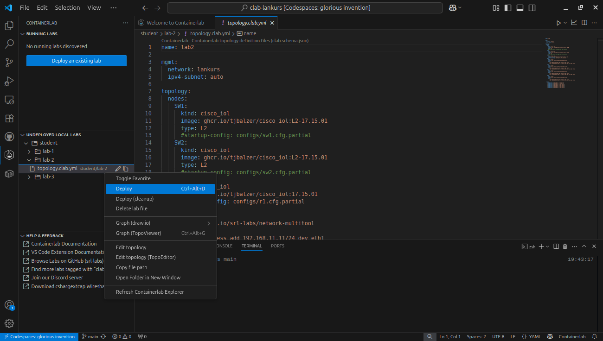
    
    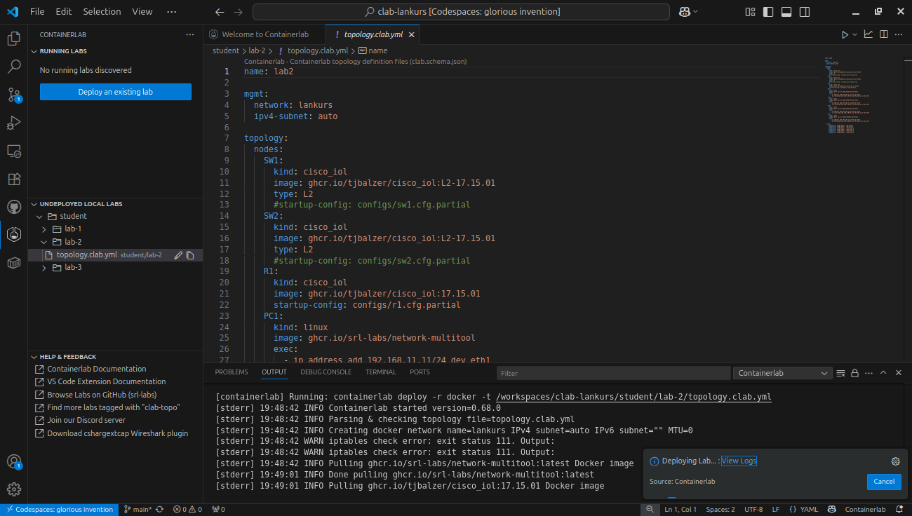
    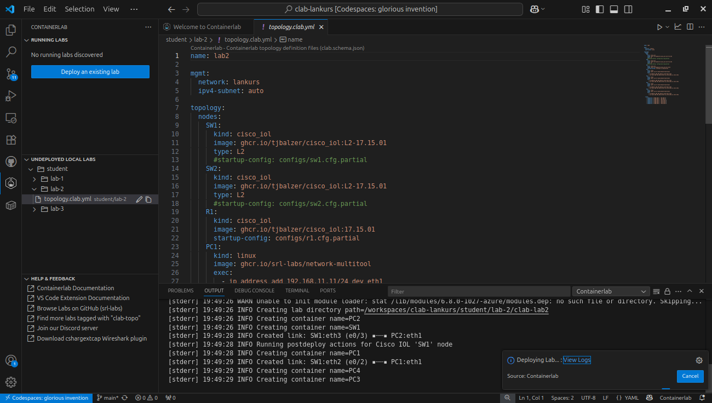
    
    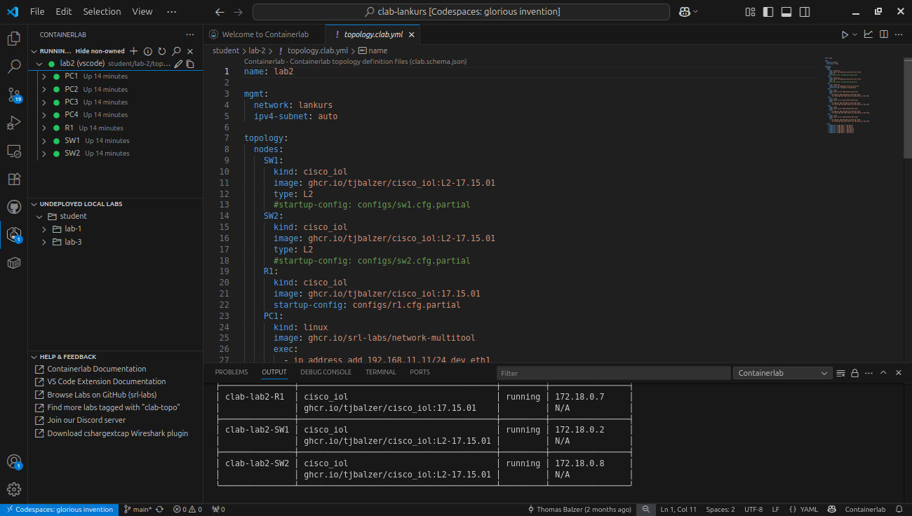

## Lab: Topology Graph des Labornetzwerkes anzeigen

Eine grafische Übersicht kann z.B. über den eingebauten Topology Viewer angezeigt werden:

- Rechtsklick auf `lab2` im Bereich `RUNNING LABS`
- Im Kontextmenü `Graph (TopoViewer)`auswählen
- In der grafuschen Ansicht werden die Devices, Ports und Verbindungen angezeigt (siehe Detailausschnitte)
- Alternativ statt Menüeintrag: ++ctrl+alt+g++

??? info "Screenshots: _Lab Topology Graph anzeigen_"
    
    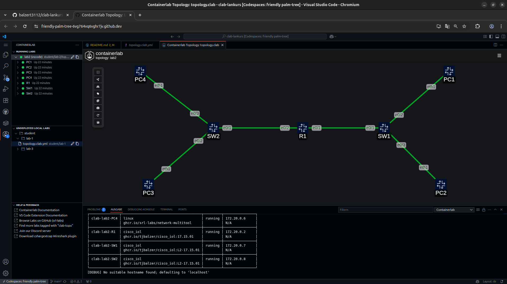
    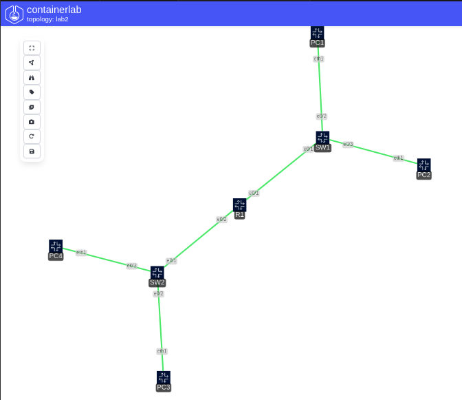
    

## Lab: Mit Kommandozeile eines PCs verbinden

Um eine Kommandozeile der PCs in einer Labor-Topologie zu öffnen gibt es drei Möglichkeiten:

Variante 1:

- Rechtsklick auf den Namen des gewünschten PCs (z.B. `PC1`) im Bereich `RUNNING LABS`
- Im Kontextmenü `Attach Shell` auswählen
- Im Bereich `TERMINAL` öffnet sich eine Shell (Kommandozeile) für den ausgeählten PC

??? info "Screenshots: _Variante 1_"
    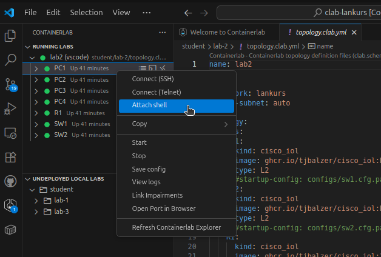
    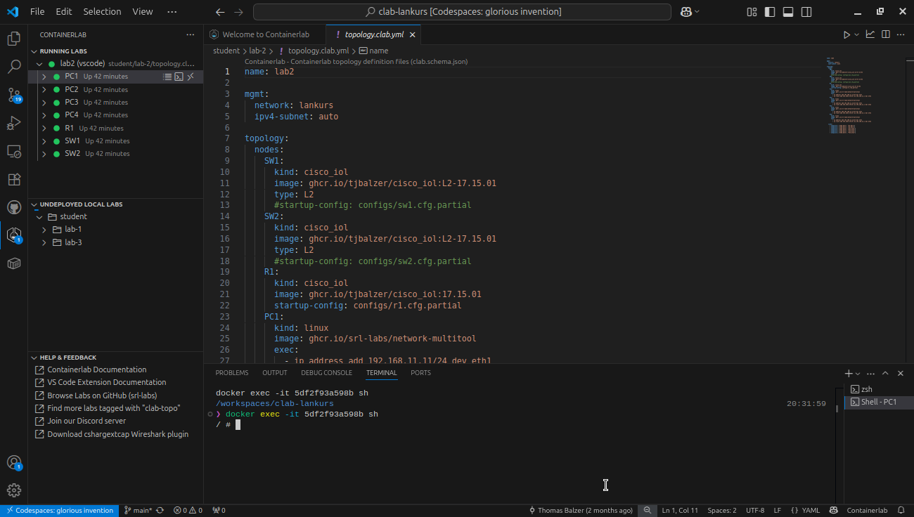

Variante 2:

- RechtAuswahl des gewünschten PCs (z.B. `PC1`) im Bereich `RUNNING LABS`
- Das mittlere der drei Symbole rechts neben dem PC auswählen 
- Im Bereich `TERMINAL` öffnet sich eine Shell (Kommandozeile) für den ausgeählten PC

??? info "Screenshots: _Variante 2_"
    
    

Variante 3:

- Symbol des PCs (z.B. PC3) in der TopoViewer-Ansicht auswählen
- Im Dialog `Actions` den Eintrag `Attach Shell`auswählen
- Im Bereich `TERMINAL` öffnet sich eine Shell (Kommandozeile) für den ausgeählten PC

??? info "Screenshots: _Variante 3_"
    
    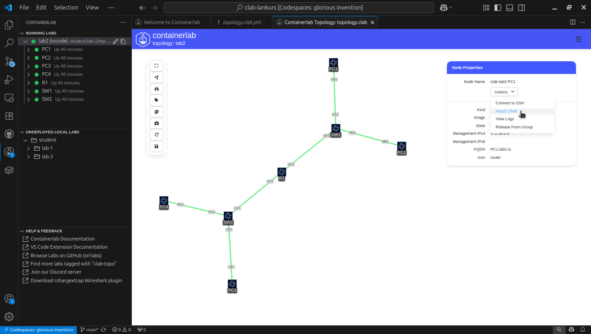
    

## Lab: Befehl auf Kommandozeile eines PCs ausführen

- Mit Kommandzeile von PC1 verbinden (siehe oben)
- Ping-Befehl für eine Prüfung der Verbindung zu PC3 eingeben:
    * `ping 192.168.12.11`
- Ping-Befehl mit ++ctrl+c++ abbrechen

??? info "Screenshot: _Ping-Befehl eingeben_"
    

## Codespace im GitHub Repository _clab_lankurs_ stoppen

Variante 1 (in VS Code):

- Auf Fläche `>< Codespaces: <Name des Codespaces>` unten links in VS Code klicken
- Im angezeigten Menü `Stop Current Codespace`auswählen
- Codespace mit Simulationsumgebung wird gestoppt

??? info "Screenshots: _Stopp Codespace (VS Code Editor)_"
    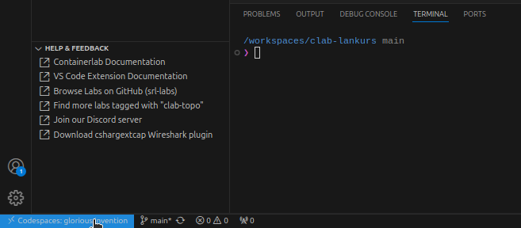
    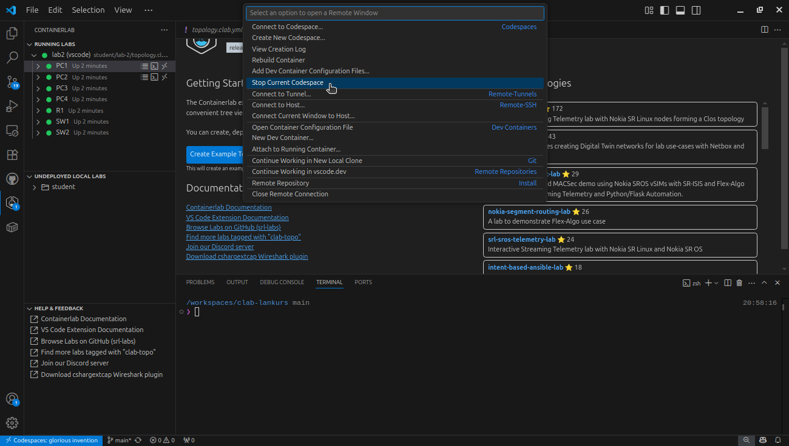
    
    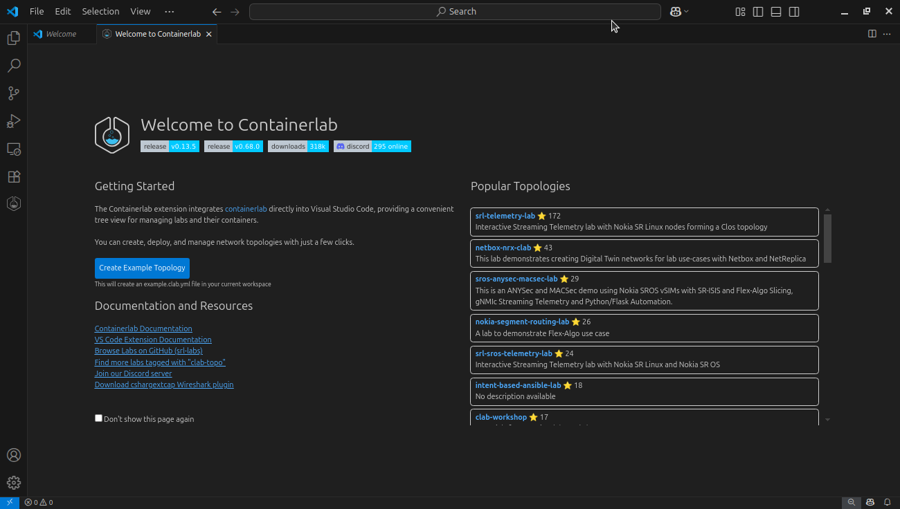

Variante 2 (direkt auf GitHub):

- Ansicht __clab-lankurs__ GitHub Repository öffnen
- Über grünen Button `<> Code` + Reiter `Codespaces` (Codespace wird als `Active` angezeigt) + `...`-Menü im Bereich `On current branch`den Eintrag `Stop codespace` auswählen
- Codespace mit Simulationsumgebung wird gestoppt

??? info "Screenshots: _Stopp Codespace (GitHub)_"
    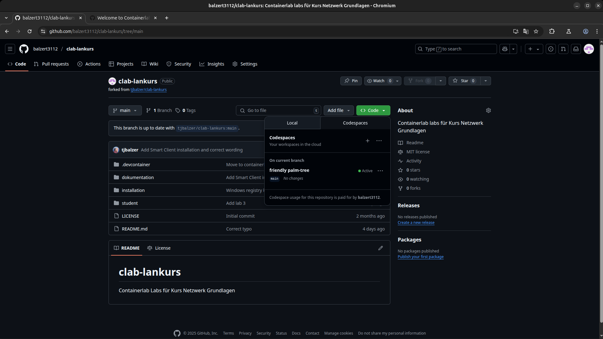
    
    

