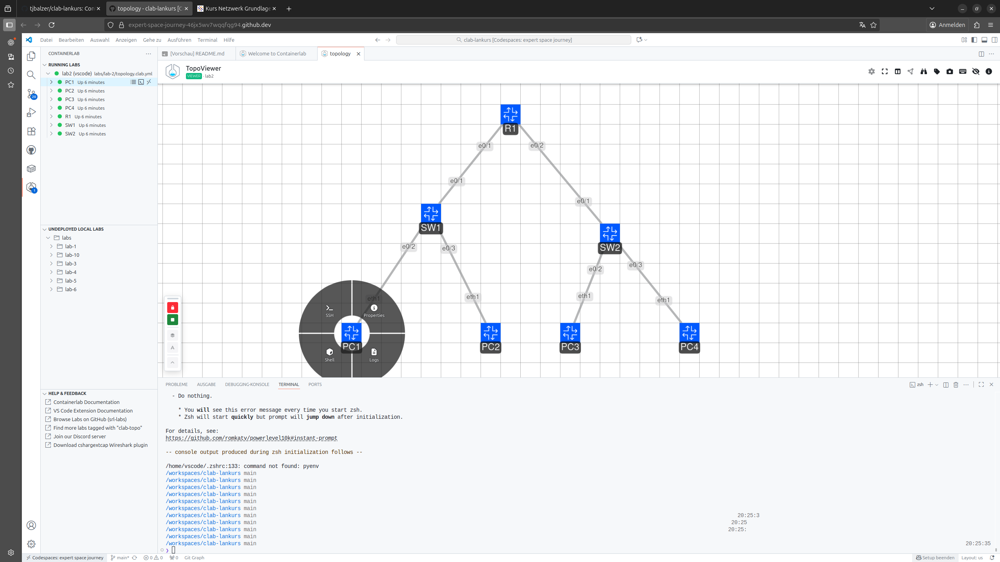
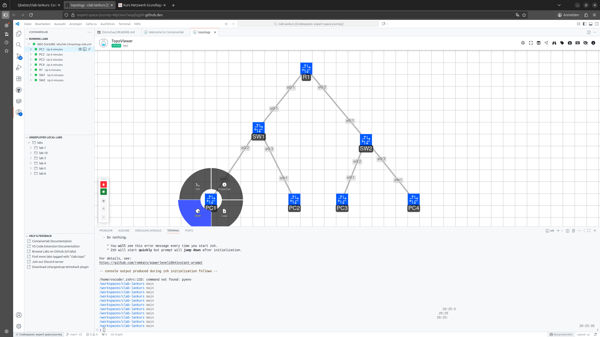

# Lab 0: Laborumgebung mit Containerlab

In dieser Übung wird gezeigt, wie der in den Vorbereitungen angelegte GitHub Codespace gestartet und gestoppt werden kann. 

Darüber hinaus wird das Basiswissen zum Umgang mit [Containerlab](https://containerlab.dev) vermittelt:

- Anzeige und Aufbau der Containerlab Topology-Dateien
- Lab in Containerlab starten und stoppen
- Grafische Anzeige des in der Topology-Datei beschriebenen Labornetzwerkes mit Hilfe des eingebauten Topology Viewers
- Verbindung mit der Kommandzeile von PCs im Labornetzwerk
- Ausführen von Befehlen in der Kommandozeile eines Labornetz-PCs


/// caption
Lab Topology
///


file:///home/tom/Netzwerke/clab-lankurs/dokumentation/site/lab0.html#lab-0-laborumgebung-mit-containerlab_1

## Codespace starten

Um mit der Laborumgebung zu arbeiten, wird der angelegte GitHub Codespace aus dem geforkten Repository gestartet. Während des Starts wird eine Browserversion von Visual Studio Code mit integriertem _Containerlab_ Plugin gestartet:

??? info "Screenshots: _GitHub Codespace starten_"
    
    
    
    
    
    

## Zugriff auf GitHub Docker Registry einrichten

!!! info
    Die für die nächsten Schritte benötigten Informationen `<YOUR_TOKEN>` und `<USERNAME>` erhalten die Schulungsteilnehmer auf drei Wegen:

    1. per E-Mail (für Smart Client Nutzer)
    2. in einer Datei auf dem Desktop des Schulungs-Notebooks (Teilnehmer ohne Smart Client)
    3. über den Kursleiter (Fallback, falls 1. + 2. nicht verfügbar)

Für die Funktion der Labornetzwerke müssen nach dem ersten Start des Codespaces einmalig beim Start des ersten Labors noch einige Docker-Images
aus einer zentralen GitHub Docker-Registry geladen werden. Um dies zu ermöglichen, muss der Zugang wie folgt eingerichtet werden:

- In VS Code ein neues Terminal über da Menü `Terminal` und den Menüeintrag `New Terminal` öffnen
- Die folgende Schritte im Bereich `TERMINAL` des in VS Code Codespace eingeben:
    * Environment-Variable mit Zugriffstoken setzen (Platzhhalter <YOUR_TOKEN> mit dem erhaltenen GitHub-Token ersetzen)
    ```
    export CR_PAT=<YOUR_TOKEN>
    ```
    * Anmeldung an die GitHub Container Registry des GitHub-Users <USERNAME> (Platzhalter <USERNAME> mit GitHub Usernamen des Kursteilnehmers ersetzen)
    ```
    echo $CR_PAT | docker login ghcr.io -u <USERNAME> --password-stdin
    ```

??? info "Screenshots: _GitHub Docker Registry Login_"
    
    
    
    

## Containerlab Topology Dateien anzeigen und ändern

- `EXPLORER`-Ansicht auswählen (Dateistruktur wird angezeigt)
- Die Dateien zu den einzelnen Übungen liegen im Verzeichnis `labs` (Lab 1 bis 10)
- Bitte Verzeichnis `labs/lab-2/` die Datei `topology.clab.yml` auswählen (Datei wird als Reiter `topology.clab.yml` im Editor-Bereich geöffnet)
- Bei Bedarf kann das Labornetzwerk über diese Datei konfiguriert werden (wird ggf. in künftigen Labs benötigt)
- Erklärungstexte für die einzelnen Bereiche können im folgenden Listing durch einen Klick auf die :material-plus-circle:-Symbole angezeigt werden

??? info "Screenshot: _Containerlab Toplogy Dateien anzeigen_"
    


  ``` yaml title="labs/lab-2/topology.clab.yml"
  name: lab2 # (1) 

  mgmt: # (2)
    network: lankurs # (3)
    ipv4-subnet: auto # (4)

  topology: # (5)
    nodes: # (6)
      SW1: # (7)
        kind: cisco_iol # (8)
        image: ghcr.io/tjbalzer/cisco_iol:L2-17.15.01 # (9)
        type: L2 # (10)
        #startup-config: configs/sw1.cfg.partial # (11)
      SW2:
        kind: cisco_iol
        image: ghcr.io/tjbalzer/cisco_iol:L2-17.15.01
        type: L2
        #startup-config: configs/sw2.cfg.partial
      R1:
        kind: cisco_iol
        image: ghcr.io/tjbalzer/cisco_iol:17.15.01
        startup-config: configs/r1.cfg.partial
      PC1:
        kind: linux
        image: ghcr.io/srl-labs/network-multitool
        exec: # (12)
          - ip address add 192.168.11.11/24 dev eth1 # (13)
          - ip route add 192.168.0.0/16 via 192.168.11.1 dev eth1 # (14)
      PC2:
        kind: linux
        image: ghcr.io/srl-labs/network-multitool
        exec:
          - ip address add 192.168.11.12/24 dev eth1 # (15)
          - ip route add 192.168.0.0/16 via 192.168.11.1 dev eth1 # (16)
      PC3:
        kind: linux
        image: ghcr.io/srl-labs/network-multitool
        exec:
          - ip address add 192.168.12.11/24 dev eth1 # (17)
          - ip route add 192.168.0.0/16 via 192.168.12.1 dev eth1 # (18)
      PC4:
        kind: linux
        image: ghcr.io/srl-labs/network-multitool
        exec:
          - ip address add 192.168.12.12/24 dev eth1 # (19)
          - ip route add 192.168.0.0/16 via 192.168.12.1 dev eth1 # (20)

    links: # (21)
      - endpoints: ["SW1:e0/1", "R1:e0/1"] # (22)
      - endpoints: ["SW2:e0/1", "R1:e0/2"]
      - endpoints: ["SW1:e0/2", "PC1:eth1"]
      - endpoints: ["SW1:e0/3", "PC2:eth1"]
      - endpoints: ["SW2:e0/2", "PC3:eth1"]
      - endpoints: ["SW2:e0/3", "PC4:eth1"]
  ```

  1. Name des Labors (ist Bestandteil des Gerätenames im Containerlab Labor)
  2. Management-Sektion: Konfiguration des Management Netzes
  3. Name des Management Netzwerks
  4. IPv4 Adressbereich des Management Netzwerks (hier: automatische Vergabe)
  5. Topology-Sektion: Beschreibung des Labornetzes (Netzwerk Nodes, verwendete Images, Konfiguration und Verbindungen)
  6. Nodes-Sektion: Beschreibung der Nodes
  7. Hostname des Nodes
  8. Kind/Typ des Nodes (z.B. `cisco_iol` oder `linux`)
  9. Name des zu verwendeten Container Image
  10. Typ (für einige Node Kinds, z.B. `cisco_iol` zur Auswahl des Layer 2 oder Layer 3 Images)
  11. Optionale Startkonfiguration für den Node (hier zur späteren Verwendung auskommentiert)
  12. Exec-Bereich für Docker-Container zur Übergabe von Befehlen, die beim Start des Containers ausgeführt werden
  13. Konfiguration der IP-Adresse von PC1
  14. Konfiguration des Default-Gateways von PC1
  15. Konfiguration der IP-Adresse von PC2
  16. Konfiguration des Default-Gateways von PC2
  17. Konfiguration der IP-Adresse von PC3
  18. Konfiguration des Default-Gateways von PC3
  19. Konfiguration der IP-Adresse von PC4
  20. Konfiguration des Default-Gateways von PC4
  21. Links-Sektion: Beschreibungd der Verbindungen zwischen den Containern
  22. Verbindung der Endpunkte SW1 Interface e0/1 nach R1 Interface eth1

## Labornetzwerk starten (Deploy)

- Containerlab-Bereich auswählen (über Containerlab Symbol im linken Randmenü)
- Im Bereich `UNDEPLOYED LOCAL LABS` das Verzeichnis `labs/lab-2` öffnen
- Rechtsklick auf Datei `topology.clab.yml` und Start des Labors über Menüeintrag `Deploy` 
- Optional: Im Informations-Dialog unten rechts `View Logs` klicken, danach kann man die Logmeldungen während des Starts im Bereich `OUTPUT` beobachten:
    * Fehlende Conatainer-Images werden aus der GitHub Docker Registry `ghcr.io` heruntergeladen und gespeichert
    * Labor Nodes werden gestartet und Verbindungen zwischen den Nodes etabliert
- Nach dem Start im Bereich `RUNNING LABS`:
    * Node Status wird farbig bzw. als `Up`/`Down` angezeigt
    * Status der einzelen Nodes durch _aufklappen_ des Labs angezeigt
- Alternativ kann die ausgewähle Topology Datei über die folgende Tastenkombination _deployed_ werden: ++ctrl+alt+d++

??? info "Screenshots: _Lab starten_"
    
    
    
    
    
    
    
    
    

## Topology Graph des Labornetzwerkes anzeigen

Eine grafische Übersicht kann z.B. über den eingebauten Topology Viewer angezeigt werden:

- Rechtsklick auf `lab2` im Bereich `RUNNING LABS`
- Im Kontextmenü `Graph (TopoViewer)`auswählen
- In der grafuschen Ansicht werden die Devices, Ports und Verbindungen angezeigt (siehe Detailausschnitte)
- Alternativ statt Menüeintrag: ++ctrl+alt+g++

??? info "Screenshots: _Lab Topology Graph anzeigen_"
    
    
    
    

## Mit Kommandozeile eines PCs verbinden

Um eine Kommandozeile der PCs in einer Labor-Topologie zu öffnen gibt es drei Möglichkeiten:

Variante 1:

- Rechtsklick auf den Namen des gewünschten PCs (z.B. `PC1`) im Bereich `RUNNING LABS`
- Im Kontextmenü `Attach Shell` auswählen
- Im Bereich `TERMINAL` öffnet sich eine Shell (Kommandozeile) für den ausgeählten PC

??? info "Screenshots: _Variante 1_"
    
    

Variante 2:

- Auswahl des gewünschten PCs mit der Maus (z.B. `PC1`) im Bereich `RUNNING LABS`
- Das mittlere der drei Symbole rechts neben dem PC auswählen (`Attach Shell`)
- Im Bereich `TERMINAL` öffnet sich eine Shell (Kommandozeile) für den ausgeählten PC

??? info "Screenshots: _Variante 2_"
    
    

Variante 3:

- Rechtsklick auf das Symbol des PCs (z.B. PC3) mit der Maus in der TopoViewer-Ansicht
- Im `Actions`-Kreis den Eintrag `Shell`auswählen
- Im Bereich `TERMINAL` öffnet sich eine Shell (Kommandozeile) für den ausgeählten PC

??? info "Screenshots: _Variante 3_"
    
    
    

## Befehl auf Kommandozeile eines PCs ausführen

- Mit Kommandzeile von PC1 verbinden (siehe oben)
- Ping-Befehl für eine Prüfung der Verbindung zu PC3 eingeben:
    * `ping 192.168.12.11`
- Ping-Befehl mit ++ctrl+c++ abbrechen

??? info "Screenshot: _Ping-Befehl eingeben_"
    

## Labornetzwerk stoppen (Destroy)

Das gestartete Labor kann über die Auswahl des Befehls `Destroy` im Kontextmenü von Lab-2 im Bereich `RUNNING LABS` beendet werden.

??? info "Screenshot: _Stopp (Desroy) Lab-2_"
    
    

## Codespace im GitHub Repository _clab_lankurs_ stoppen

- Ansicht __clab-lankurs__ GitHub Repository öffnen
- Über grünen Button `<> Code` + Reiter `Codespaces` (Codespace wird als `Active` angezeigt) + `...`-Menü im Bereich `On current branch` den Eintrag `Stop codespace` auswählen
- Codespace mit Simulationsumgebung wird gestoppt

??? info "Screenshots: _Stopp Codespace (GitHub)_"
    
    
    
