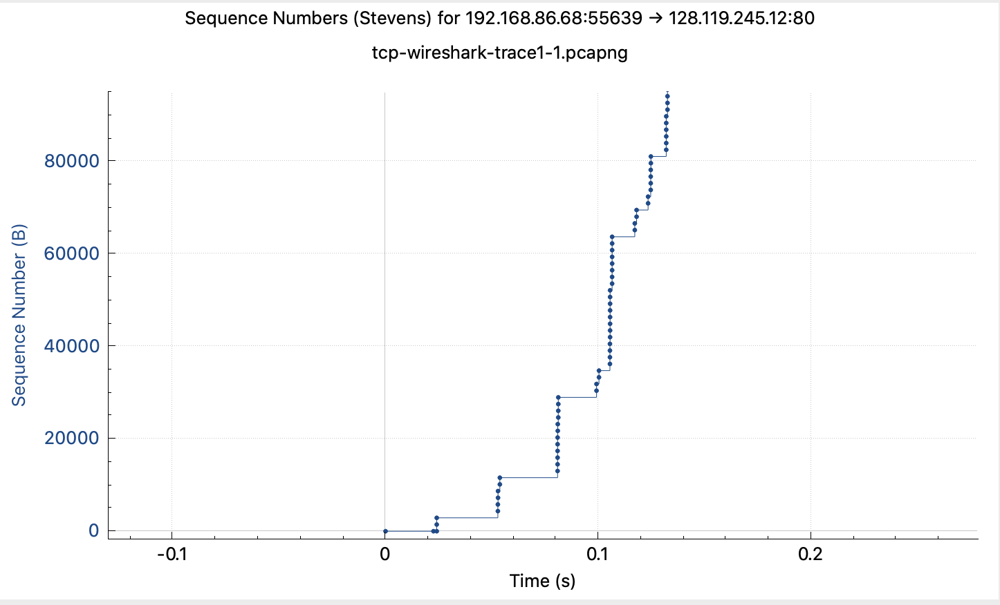

# Lab 11: Transmission Control Protocol (TCP)

Quelle: Orginalaufgabe als Ergänzung zu „Computer Networking: A Top-Down Approach“, 8. Auflage von J.F. Kurose und K.W. Ross (ins Deutsche übersetzt mit Hilfe von ChatGPT).

© 2005–2021, J.F. Kurose und K.W. Ross. Alle Rechte vorbehalten.

## Einführung

In diesem Lab werden wir das Verhalten des bekannten **TCP-Protokolls** im Detail untersuchen. Wir analysieren dabei einen **Mitschnitt von TCP-Segmenten**, die beim Übertragen einer 150 KB großen Datei (Alice's Adventures in Wonderland) von deinem Rechner zu einem entfernten Server gesendet und empfangen werden.

Wir betrachten:  
- TCPs Nutzung von Sequenz- und Acknowledgement-Nummern für zuverlässige Übertragung  
- TCPs Staukontrollalgorithmus (Slow Start und Congestion Avoidance)  
- Das Flow-Control-Mechanismus des Empfängers (Window Size)  
- Kurz den Verbindungsaufbau  
- Die Leistung (Durchsatz und RTT) der TCP-Verbindung

## 1. Aufzeichnen eines großen TCP-Transfers

Bevor wir TCP im Detail analysieren, musst du einen **Mitschnitt** eines TCP-Transfers aufnehmen, bei dem eine Datei von deinem Rechner auf einen entfernten Server hochgeladen wird.

Das machen wir über eine Webseite, auf der du die Datei auswählen und via HTTP POST hochladen kannst. Der HTTP POST wird dabei über eine TCP-Verbindung übertragen.

### Schritte

- Öffne deinen Webbrowser und lade eine Textversion von [Alice in Wonderland](http://gaia.cs.umass.edu/wireshark-labs/alice.txt) herunter und speichere die Datei als `.txt` auf deinem Rechner
-  Gehe anschließend auf die [Upload-Seite](http://gaia.cs.umass.edu/wireshark-labs/TCP-wireshark-file1.html) -- auf dieser Seite kannst du die Datei hochladen

- Klicke auf **Browse** bzw. **Datei auswählen** und wähle deine gespeicherte Datei aus (**Wichtig:** Drücke **noch nicht** auf „Upload alice.txt file“!)
- Starte jetzt **Wireshark** und beginne die Paketerfassung
- Wechsle zurück zum Browser und klicke auf **Upload alice.txt file**
- Die Datei wird via **HTTP POST** (und damit über TCP) an den Server `gaia.cs.umass.edu` gesendet
- Warte, bis eine Bestätigungsmeldung erscheint
- Stoppe danach die Aufzeichnung in Wireshark

Dein Wireshark-Fenster sollte jetzt die TCP-Segmente der Übertragung enthalten.

> Falls du keinen eigenen Mitschnitt machen kannst, kannst du auch ein Beispiel-Tracefile herunterladen:
> [http://gaia.cs.umass.edu/wireshark-labs/wireshark-traces-8.1.zip](http://gaia.cs.umass.edu/wireshark-labs/wireshark-traces-8.1.zip)

## 2. Erster Blick auf den Mitschnitt

Bevor wir tief ins Detail gehen, werfen wir einen groben Blick auf den Mitschnitt.

- Finde die **HTTP POST**-Nachricht in deinem Trace, mit der die Datei hochgeladen wurde
- Klappe in Wireshark die Details der HTTP-Nachricht auf, um den POST genau zu untersuchen

!!! info
    Als Beispiel dient hier das vorbereitete Tracefile `tcp-wireshark-trace1-1.pcapng`. Hier sehen wir: 

    - Paket #153 enthält die HTTP POST-Nachricht
    - Der Body der HTTP POST-Nachricht enthält die gesamte Datei alice.txt (über 152 KB)
    - Die Datei passt nicht in ein einzelnes TCP-Segment
    - Stattdessen wird sie über viele Segmente verteilt (z. B. über 100 Segmente im Beispieltrace)
    - Wireshark zeigt auch an, dass das erste TCP-Segment, welches die POST-Message enthält, Paket #4 ist, das zweite TCP-Segment Paket #5, etc.

- Filtere die Anzeige in Wireshark auf TCP-Segmente mit dem Filter `tcp`, damit siehst du alle TCP-Segmente zwischen deinem Rechner und dem Server

### Analysefragen

Die folgenden Fragen können entweder mit Hilfe einer eigenen Messung beantwortet werden oder mit Hilfe des fertigen Wireshark Tracefiles `tcp-wireshark-trace1-1.pcapng`

1. Welche IP-Adresse und welchen TCP-Port nutzt dein Rechner als **Quelle** beim Hochladen?  
    * Tipp: Wähle ein HTTP-Paket und schaue dir den TCP-Header in den Details an.
2. Welche IP-Adresse hat **gaia.cs.umass.edu**?  
    * Auf welchem Port empfängt und sendet er TCP-Segmente für diese Verbindung?
3. Was ist die **Sequenznummer** des TCP-SYN-Segments, das die Verbindung aufbaut?
    * Woran erkennst du in diesem Segment, dass es ein **SYN** ist?
    * Unterstützt der Empfänger in dieser Sitzung **Selective Acknowledgments**?
4. Was ist die **Sequenznummer** des **SYNACK**-Segments, das vom Server zurückkommt?
    * Woran erkennst du das SYNACK?
    * Welchen Wert hat das Acknowledgement-Feld im SYNACK?
    * Wie wurde dieser Wert bestimmt?
5. Was ist die Sequenznummer des TCP-Segments, das den **HTTP POST**-Header enthält?
    * Wieviele Bytes enthält das **Payload/Data-Feld** dieses Segments?
    * Passte die gesamte Datei alice.txt in dieses eine Segment?
6. Betrachte dieses erste Segment als Start der **Datenübertragung**:
    * Zu welcher Zeit wurde es gesendet?
    * Wann kam das ACK dafür zurück?
    * Wie groß ist das **RTT** für dieses Segment?
    * Wie groß ist das RTT für das zweite Daten-segment und dessen ACK?
    * Was ist der **EstimatedRTT**-Wert nach Empfang des ACKs für das zweite Segment?
        * Verwende die Formel im Buch (Kapitel 3.5.3) mit `α = 0.125` und als Anfangswert den gemessenen RTT des ersten Segments
7. Wie lang (Header + Payload) sind die **ersten vier Daten-Segmente**?
8. Welchen kleinsten **Buffer-Wert (Window Size)** hat der Server in diesen vier ersten Daten-Segmenten dem Client angeboten?
    * Hat der Mangel an Buffer-Space den Sender gedrosselt?
9. Gibt es **Retransmissions** im Trace?
    * Woran erkennst du das in Wireshark?
10. Wie viel Daten werden typischerweise in einem **ACK** bestätigt (bei den ersten zehn Daten-Segmenten)?
    * Gibt es Fälle, wo der Empfänger **nur jedes zweite Segment** bestätigt?
11. Wie groß ist der **Durchsatz** (Bytes pro Zeit)?  
    * Erkläre, wie du diesen Wert berechnet hast.

> Tipp:  
> Wireshark hat eine schöne Funktion, um RTTs zu plotten:  
> Menü: `Statistics -> TCP Stream Graph -> Round Trip Time Graph`

## 4. _TCP Congestion Control_ in Aktion (für Fortgeschrittene)

Betrachte, wie viel Daten pro Zeiteinheit vom Client zum Server gesendet werden.  

- Wireshark bietet dafür ein praktisches Tool: `Statistics -> TCP Stream Graph -> Time-Sequence-Graph (Stevens)`
- Wähle ein vom Client gesendetes TCP-Segment (im Upload) aus und rufe das Diagramm auf
- Im Graphen siehst du, wie die Sequenznummern über die Zeit verlaufen

12. Schau dir die **_Paketschübe_** um folgende Zeitpunkte an (z. B. t = 0.025, t = 0.053, t = 0.082, t = 0.1):  
    * Sieht das aus wie **Slow Start**, **Congestion Avoidance** oder etwas anderes?  
    * Beschreibe deine Beobachtung
13. Diese Paketschübe scheinen eine gewisse **Periodizität** zu haben.  
    * Was kannst du dazu sagen?
14. Beantworte Fragen 12 und 13 auch für **deinen eigenen Mitschnitt**, falls du einen gemacht hast.

Andere Ansicht der selben Daten:

