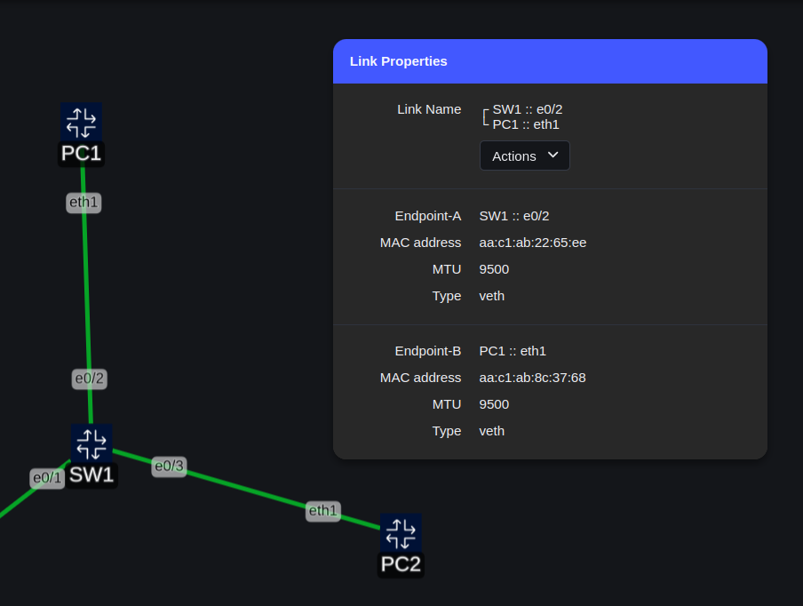

# Lab 4: Ethernet, ARP & IP Adressen


/// caption
Lab Topology
///

In dieser Übung analysierst du das **Ethernet-Protokoll** und das **Address Resolution Protocol (ARP, RFC 826)**. Bevor du startest, stelle sicher, dass du die Grundlagen des Ethernet-MAC-Layers und von ARP verstanden hast.

ARP wird von einem IP-System verwendet, um zu einer bekannten IP-Adresse die passende MAC-Adresse zu ermitteln.

## Vorbereitung

- Verbinde VS Code mit dem GitHub Codespace
- Starte das Lab-4 im GitHub Codespace
- Installiere Edgeshark im GitHub Codespace

## Ping-Test mit Wireshark-Mitschnitt

Nach dem Lab-4 erfolgreich gestartet wurde:

- Verbinde dich mit der Kommandozeile von PC1 (Attach)
- Starte einen Wireshark-Mitschnitt auf dem Interface `eth1` von PC1 (damit werden die Pakete auf dem Link zwischen PC1 und SW1 aufgezeichnet)
- Führe auf PC1 folgenden Ping-Befehl aus (Ziel ist die IP-Adresse von PC3 hinter dem Router R1 an SW2):
    * `ping 192.168.12.11`
- Ping-Befehl nach ca. 5 Pings mit ++ctrl+c++ stoppen
- Wireshark Aufzeichnung stoppen

## Analyse der ersten Ping-Anfrage

Suche in der Wireshark-Paketliste das **erste Ping-Paket (ICMP Echo Request)**. Markiere es und beantworte die folgenden Fragen:

!!! question "Fragen"
    - Welche 48-Bit-Ethernet-Adresse hat der Sender?
    - Wie lautet die Ethernet-Adresse des Empfängers?
        * Ist das die Ethernet-Adresse von PC3? Wenn nein: Wessen Ethernet-Adresse ist es (Wissensfrage)?
    - Welcher hexadezimale Wert steht im Ethernet Frametyp-Feld?
        * Was bedeutet dieser Wert?

!!! info
    Die Ethernet-Adressen der PCs können ihr auf der Kommandozeile der PCs wie folgt abgefragt werden (Interface `eth1` ist mit dem Labornetz verbunden):
    ```
    ip link show eth1
    ```
    !!! example "Beispiel"
        ```
        / # ip link show eth1
        19: eth1@if18: <BROADCAST,MULTICAST,UP,LOWER_UP> mtu 9500 qdisc noqueue state UP mode DEFAULT group default 
            link/ether aa:c1:ab:8c:37:68 brd ff:ff:ff:ff:ff:ff link-netnsid 1
        / # 
        ```
    ??? info "Alternativ: _Ethernet-Adresse im TopopViewer anzeigen_"
        Link zwischen PC und Switch mit der rechten Maus auswählen und im `Kreismenü`den Sektor `Properties` auswählen. Dann wird wie MAC-Adresse in einer Infobox `Link Properties` angezeigt:
        

## Analyse der Ping-Antwort

Suche das **erste Ping-Antwortpaket (ICMP Echo Reply)** und beantworte die folgenden Fragen:

!!! question "Fragen"
    - Wie lautet die Ethernet-Adresse des Senders?
        * Gehört die Ethernet-Adresse dem Sender oder dem Empfänger? Wenn nein: Von Welchem Gerät stammt die Ethernet-Adresse (Wissensfrage)?
    - Welche Ziel-Ethernet-Adresse steht im Paket?
        * Ist das die Adresse von PC1?
    - Welcher hexadezimale Wert steht im 2-Byte Ethernet Frametyp-Feld?
        * Was bedeutet dieser Wert?
        * Welche weiteren Typfeld-Werte kennst du?

??? tip "Spickzettel"
    Wenn du dir bei den Antworten auf die Wissensfragen unsicher bist, kannst du z.B. die Ethernet-Adressen des Routers wie folgt überprüfen:

    - SSH-Verbindung zu `R1` aufbauen:
    
    - Nach Aufforderung das Passwort `admin` eingeben (Zeichen werden unterdrückt):
    ```
    $ ssh admin@clab-lab4-R1
    Warning: Permanently added 'clab-lab4-r1' (RSA) to the list of known hosts.
    (admin@clab-lab4-r1) Password: 

    R1#
    ```
    - Anzeige der Interfaces von `R1`:
    ```
    show int e0/1
    ```
    Ausgabe:
    ```
    R1#sh int e0/1
    Ethernet0/1 is up, line protocol is up 
        Hardware is AmdP2, address is aabb.cc00.0510 (bia aabb.cc00.0510)
        Internet address is 192.168.11.1/24
        MTU 1500 bytes, BW 10000 Kbit/sec, DLY 1000 usec, 
    ... <Ausgabe gekürzt>
    ```
    ```
    show int e0/2
    ```
    Ausgabe:
    ```
    R1#sh int e0/2
    Ethernet0/2 is up, line protocol is up 
    Hardware is AmdP2, address is aabb.cc00.0520 (bia aabb.cc00.0520)
    Internet address is 192.168.12.1/24
    MTU 1500 bytes, BW 10000 Kbit/sec, DLY 1000 usec, 
    ```
    - Wird die Ausgabe mit dem Hinweis `--More--` gestoppt, hat man folgende Möglichkeiten:
        * Mit der Taste ++space++ die Ausgabe fortsetzen
        * Mit der Taste ++enter++ die Ausgabe zeilenweise fortsetzen
        * Mit der Taste ++q++ die Ausgabe abbrechen 

    !!! warning "Warnung"
        Wenn du im TopoViewer den Link zwischen PC1 und R1 mit der Maus selektierst, erscheint eine Infobox mit den `Link Properties`. Die dort für `R1`angegebene MAC-Adresse ist NICHT die Adresse des Routers, sondern die Adresse des Containers, in welchem der Router als virtuelle Maschine (VM) läuft!

??? note "ARP- Cache auf Cisco Routern"
    Natürlich nutzt auch ein Router ARP-Requests, um die Ethernet-Adresse eines Endgerätes in einem direkt angeschlossenen IP-Subnets zu ermitteln und speichert die Daten aus den ARP-Replies in seinem eigenen ARP-Cache, der wie folgt angezeigt werden kann:
    ```
    show arp
    ```
    Ausgabe:
    ```
    R1#sh ip arp
    Protocol  Address          Age (min)  Hardware Addr   Type   Interface
    Internet  192.168.11.1            -   aabb.cc00.0510  ARPA   Ethernet0/1
    Internet  192.168.11.11           0   aac1.abb4.340d  ARPA   Ethernet0/1
    Internet  192.168.12.1            -   aabb.cc00.0520  ARPA   Ethernet0/2
    Internet  192.168.12.11           0   aac1.ab61.0e4c  ARPA   Ethernet0/2
    ```
    Der ARP-Cache des Routers lässt sich über das folgenden Befehl auf der Kommandozeile des Routers löschen:
    ```
    clear arp-cache
    ```
    Allerdings zeigt sich, dass die Einträge nach dem löschen des ARP-Cache nach wie in der Tabelle angezeigt werden:
    ``` 
    R1#clear arp-cache 
    R1#sh arp          
    Protocol  Address          Age (min)  Hardware Addr   Type   Interface
    Internet  192.168.11.1            -   aabb.cc00.0510  ARPA   Ethernet0/1
    Internet  192.168.11.11           0   aac1.abb4.340d  ARPA   Ethernet0/1
    Internet  192.168.12.1            -   aabb.cc00.0520  ARPA   Ethernet0/2
    Internet  192.168.12.11           0   aac1.ab61.0e4c  ARPA   Ethernet0/2
    ```
    Das liegt an der Implementierung von Cisco: Der Befehl `clear arp-cache` löscht zwar tatsächlich die dynamischen Einträge, allerdings führt der Router sofort nach der Löschung neue ARP-Anfragen für die gelöschten Einträge aus, um zu überprüfen, ob die Endgeräte noch antworten und damit erreichbar sind, inkl. eines Gratuitous ARP mit der Adresse seines eigegenen Interfaces im jeweiligen IP-Subnetz (Prüfung auf ggf. doppelte Vergabe der IP-Adresse des Router-Interfaces):
    

## ARP-Tabelle betrachten

- Mit dem folgenden Befehl auf PC1 die ARP-Tabelle anzeigen (`neigh` ist die Kurzform für `neighbours`: Anzeige der _bekannten Nachbarn_ im IP-Subnetz):
  ```
  ip neigh show
  ```
- Für den Fall, dass die Tabelle leer ist (nach einiger Zeit verlieren Einträge ihre Gültigkeit und gehen vom Status `REACHABLE` in den Status `STALE`, wenn keine weitere Kommunikation zur gelisteten IP-Adresse stattgefunden hat) oder keine Einträge mehr enthalten sind, die mit `192.168.` beginnen:
    * Wiederhole den Ping von PC1 nach PC3
    * Dann erneut auf PC1 `ip neigh show` ausführen

!!! question "Aufgabe"
    Notiere die ARP-Tabelle und erkläre:

    - Die Bedeutung der Spalten
    - Die Bedeutung der Einträge

!!! info
    Der `ip`-Befehl ist hier dokumentiert: [ip(8) - Linux manual page](https://man7.org/linux/man-pages/man8/ip.8.html)
    Das Kommando `ip neighbour` ist hier dokumentiert: [ip-neighbour(8) - Linux manual page](https://man7.org/linux/man-pages/man8/ip-neighbour.8.html)

## ARP-Tabelle löschen

- Lösche die ARP-Tabelle für das Interface `eth1` durch Eingabe des folgenden Befehls auf PC1:
  ```
  ip neighbor flush dev eth1
  ```
- Kontrolliere den Inhalt der ARP-Tabelle:
  ```
  ip neigh show
  ```
- Die Tabelle sollte nun leer sein (es werden keine dynamischen Einträge für Interface `eth1` angezeigt)

## Erneuter Mitschnitt mit Wireshark

- Starte Wireshark auf Interface `eth1` von PC1
- Wiederhole den Ping von PC1 nach PC3
- Stoppe den Ping-Befehl auf PC1 nach 4-5 Pings über ++ctrl+c++
- Achte darauf: Du willst diesmal **nur Ethernet- und ARP-Pakete** sehen
    * Hierfür passen wir die Wireshark-Ansicht entsprechend an und schalten die Protkollunterstützung für IPv4 aus

## Protokollunterstützung für IPv4 deaktivieren

- Gehe im Wireshark-Menü auf: `Analyse >> Protokolle aktivieren`
- Deaktiviere **IPv4** durch Abwählen des entsprechenden Kästchens
- Stelle sicher, dass der Anzeigebereich für die Paketbytes aktiviert ist

??? info "Aktivieren/deaktivieren der Wireshark IPv4 Protokollunterstützung"
    
    

??? info "Anzeigebereich für _Paketbytes_ anzeigen"
    

## Analyse des ARP-Requests

Suche in Wireshark das **ARP-Request-Paket**, markiere es und beantworte die folgenden Fragen:

!!! question "Fragen"
    - Wie lauten die Werte für Quell- und Zieladresse im Ethernet-Frame?
    - Welchen hexadezimalen Wert hat das Ethernet Frametyp-Feld und welche Bedeutung hat dieser Wert?
    - Nach wie vielen Bytes ab Frame-Beginn beginnt das Opcode-Feld („Operation“)? => Byteansicht in Wireshark einblenden
    - Welcher Wert steht im Opcode/Operation-Feld?
        * Welche Art ARP-Paket ist das?
    - Enthält das ARP-Request-Paket die IP-Adresse des Senders?
    - Wo steht im ARP-Request die IP-Adresse des Systems, dessen MAC-Adresse erfragt wird?

## Analyse des ARP-Replies

Finde das **ARP-Reply-Paket** und beantworte die folgenden Fragen:

!!! question "Fragen"
    - Nach wie vielen Bytes ab dem Beginn des ARP-Replies beginnt das Opcode-Feld? => Byteansicht in Wireshark einblenden
    - Welcher Wert steht im Opcode/Operation-Feld?
    - Wo im ARP-Reply-Paket steht die Antwort auf die im ARP-Request gestellte Frage?
        * Wo im Paket findet man die IP-Adresse, die zur MAC-Adresse gehört?
    - Welches sind die hexadezimale Werte der Quell- und Zieladressen des ARP-Replies?
        * Welchen Systemen gehören diese Adressen?

## Wireshark-Ansicht zurücksetzen

- Gehe im Wireshark-Menü wieder auf: `Analyse >> Protokolle aktivieren`
- Aktiviere Protokollunterstützung für IPv4 wieder durch Anwahl des entsprechenden Kästchens

## Bonus-Aufgabe: Tracefile-Analyse

- Öffne in Wireshark das Tracefile über das Menü `Datei >> Öffnen` oder ++alt+d+o++: `ethernet-wireshark-trace1.pcapng` im SharePoint-Verzeichnis `Kurs Netzwerk Grundlagen/Computer Networking - A Top-Down Approach (Kurose & Ross)/Wireshark Tracefiles/wireshark-traces-8.1`
- Finde die ARP-Request-/Reply-Pakete in der Paketliste:
    * ARP-Request des Wireshark-PCs
    * ARP-Reply des Netzteilnehmers, nach dessen MAC-Adresse im ARP-Request gefragt wurde 

!!! info
    In diesem Szenario läuft Wireshark auf dem Rechner, welcher den ARP-Request gesendet hat.

!!! question "Fragen"
    - Wie lautet die IP-Adresse des PCs, auf dem Wireshark läuft?
    - Zu welcher IP-Adresse sucht der PC die Ethernet-Adresse und wie lautet die MAC-Adresse des gesuchten Gerätes?
    - In diesem Netzwerk haben viele weitere Geräte einen ARP-Request gesendet (siehe Wireshark Paketliste). Warum sind dazu keine passenden ARP-Replies  im Wireshark Tracefile enthalten?

!!! note
    Diese Aufgabe ist unabhängig von den vorherigen Übungen.
    Der PC mit Wireshark war an einem **Standard-Switchport** und nicht an einem Mirror-Port angeschlossen.
