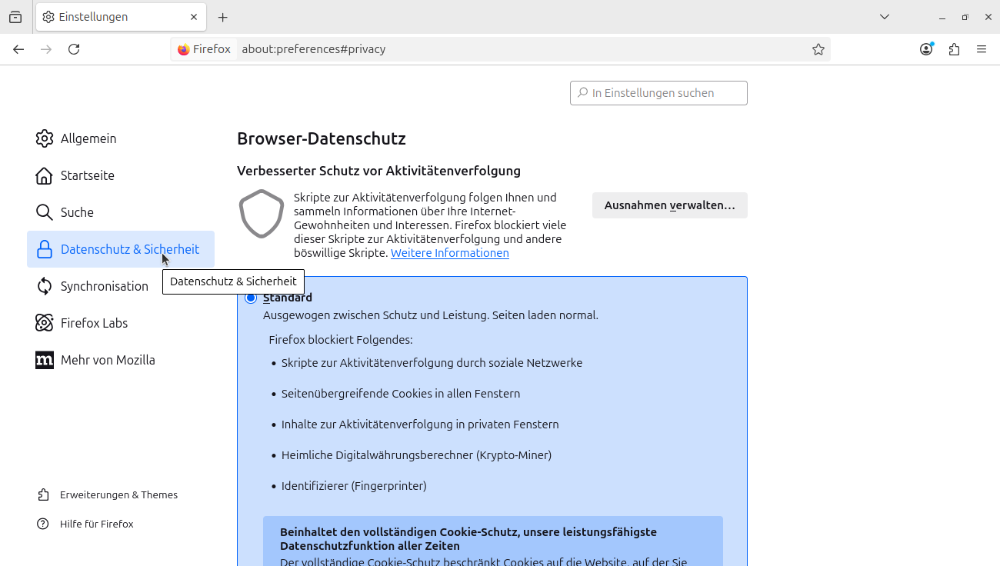
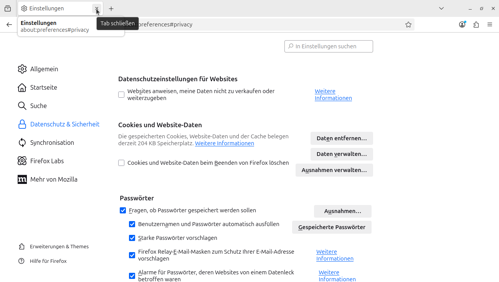

# Lab 9: Domain Name System Protokol (DNS)

Quelle: Orginalaufgabe als Ergänzung zu „Computer Networking: A Top-Down Approach“, 8. Auflage von J.F. Kurose und K.W. Ross (ins Deutsche übersetzt mit Hilfe von ChatGPT).

© 2005–2021, J.F. Kurose und K.W. Ross. Alle Rechte vorbehalten.

## Einführung

Das Domain Name System (DNS) Hostnamen in IP-Adressen und übernimmt so eine entscheidende Rolle in der Internet-Infrastruktur.

In diesem Labor betrachten wir die Client-Seite von DNS. Die Rolle des Clients ist dabei relativ einfach: Der Client stellt eine Anfrage an seinen lokalen DNS-Server und erhält eine Antwort zurück.


/// caption
Lab Topology
///

Wie im Kurs gezeigt, kann im Hintergrund viel passieren, wenn die hierarchischen DNS-Server untereinander kommunizieren (rekursiv oder iterativ), um die Anfrage aufzulösen. Für den DNS-Client selbst bleibt das Protokoll jedoch sehr einfach – er stellt eine Anfrage an den lokalen Server und erhält eine Antwort.

Bevor du dieses Labor startest, sollten im Unterricht vor allem die Themen lokale DNS-Server, DNS-Caching, DNS-Records und Nachrichtenformate sowie das TYPE-Feld im DNS-Record behandelt worden sein. 

!!! tip
    **Beispiel-Tracedateien:**
    Falls du keine Live-Aufzeichnungen machen möchtest oder kannst, findest du Beispiel-Traces herunterladen:
    [http://gaia.cs.umass.edu/wireshark-labs/wireshark-traces-8.1.zip](http://gaia.cs.umass.edu/wireshark-labs/wireshark-traces-8.1.zip)
 
    Dort findest du fertige .pcap/.pcapng-Dateien, die genau diese Experimente enthalten.

    Alternativ kann dir dein Kursleiter auch sagen, wo diese Dateinen auf dem Schulungsnotebook abgelegt sind bzw. wo sie im Firmennetzwerk zu finden sind.

## 1. nslookup

Wir beginnen unsere Untersuchung des DNS mit dem Befehl **nslookup**, der die darunterliegenden DNS-Dienste nutzt. Der Befehl **nslookup** ist auf den meisten Microsoft-, Apple- und Linux-Betriebssystemen verfügbar.

Um **nslookup** zu starten, gibt man einfach den Befehl in ein Terminal- oder Eingabefenster ein: `nslookup`

Das funktioniert in der DOS-Eingabeaufforderung (Windows), im MacOS-Terminal oder in der Linux-Shell.

### Grundlegende Funktion

In seiner einfachsten Form erlaubt **nslookup** dem Host, auf dem es ausgeführt wird, eine DNS-Anfrage an einen beliebigen DNS-Server zu schicken. Der befragte DNS-Server kann dabei ein Root-Server, ein Top-Level-Domain-Server (TLD), ein autoritativer Server oder ein zwischengeschalteter DNS-Server sein. Ein Beispiel ist das Abrufen eines „Type=A“-Records, der einen Hostnamen (z. B. www.nyu.edu) in eine IP-Adresse übersetzt.

**Ablauf:**

- nslookup sendet eine DNS-Anfrage an den spezifizierten Server (oder, falls keiner angegeben ist, an den lokalen Standard-DNS-Server)
- Es erhält eine Antwort
- Und zeigt das Ergebnis an.

### Beispiel 1: Einfachste Verwendung

Auf einem Linux-Host im lokalen Netzwerk des Kursleiters (X1.fritz.box) an seinem Wohnort, mit dem lokalen DNS-Server 10.10.10.1 (lokaler DSL-Router):

```
tom@X1:~$ nslookup www.enbw.de
Server:		10.10.10.1
Address:	10.10.10.1#53

Non-authoritative answer:
www.enbw.de	canonical name = enbw.de.
Name:	enbw.de
Address: 195.35.76.193
```

!!! note
    Obwohl die Antwort vom lokalen DNS-Server kam, kann dieser Server im Hintergrund andere DNS-Server kontaktiert haben (rekursiv oder iterativ), um die Antwort zu ermitteln.

!!! abstract "Erklärung"
    - Der Befehl fragt „Bitte gib mir die IP-Adresse für www.enbw.de.“
    - Die Antwort zeigt:
        1. Den Namen und die IP-Adresse des antwortenden DNS-Servers (hier der lokale DNS-Server auf dem DSL-Router)
        2. Den kanonischen Hostnamen und die IP-Adressen für www.enbw.de

```
tom@X1:~$ nslookup www.heise.de
Server:		10.10.10.1
Address:	10.10.10.1#53

Non-authoritative answer:
Name:	www.heise.de
Address: 193.99.144.85
Name:	www.heise.de
Address: 2a02:2e0:3fe:1001:7777:772e:2:85
```

Im zweiten Beispiel gibt es für für `www.heise.de` zwei IP-Adressen:

- eine **IPv4-Adresse**: 193.99.144.85
- eine **IPv6-Adresse**: 2a02:2e0:3fe:1001:7777:772e:2:85 

### Beispiel 2: TYPE=NS-Abfrage

Neben Type=A-Abfragen kann nslookup auch nach NS-Records fragen, also den autoritativen Nameservern für eine Domain:

```
tom@X1:~$ nslookup -type=NS netze-bw.de
Server:		10.10.10.1
Address:	10.10.10.1#53

Non-authoritative answer:
netze-bw.de	nameserver = nss01.enbw.com.
netze-bw.de	nameserver = nss02.enbw.com.

Authoritative answers can be found from:
```

!!! abstract "Erklärung"
    - Mit `-type=NS` fragt nslookup nach den Nameservern der Domain netze-bw.de.
    - Die Antwort enthält:
        * Den antwortenden DNS-Server (lokaler DSL-Router)
        * Die autoritativen Nameserver für netze-bw.de

!!! note  
    Die Antwort wird hier als „non-authoritative“ gekennzeichnet. Das bedeutet, sie stammt aus dem Cache eines Servers und nicht direkt von einem autoritativen Server für netze-bw.de.

Die IP-Adressen der ermittelten authoritativen Nameserver erhält man z.B. wie folgt:

```
tom@X1:~$ nslookup nss01.enbw.com
Server:		10.10.10.1
Address:	10.10.10.1#53

Non-authoritative answer:
Name:	nss01.enbw.com
Address: 195.35.72.246
```

Die IP-Adresse von `nss01.enbw.com` lautet 195.35.72.246.

### Beispiel 3: Reverse DNS Lookup

Manchmal will man den Hostnamen zu einer IP-Adresse herausfinden – also umgekehrt. Auch das geht mit nslookup:

```
tom@X1:~$ nslookup 195.35.76.193
193.76.35.195.in-addr.arpa	name = www.enbw.de.

Authoritative answers can be found from:

```

!!! abstract "Erklärung"
    Hier liefert nslookup den Hostnamen (www.enbw.de) für die gegebene IP-Adresse.

### Weitere Optionen

nslookup bietet noch viele weitere Optionen außer „-type=NS“. Ein paar Ressourcen:

- Beispiele: [10 beliebte nslookup-Befehle](https://www.cloudns.net/blog/10-most-used-nslookup-commands/)
- Man-Pages: [https://linux.die.net/man/1/nslookup](https://linux.die.net/man/1/nslookup)

## 2. Der DNS-Cache auf deinem Rechner

Wenn du im Lehrbuch die Abbildungen 2.19 und 2.20 zu rekursiver und iterativer DNS-Auflösung anschaust, könnte man denken, dass der lokale DNS-Server jedes Mal kontaktiert werden muss, wenn eine Anwendung einen Hostnamen in eine IP-Adresse übersetzen will.

Das ist in der Praxis aber nicht immer so!

Die meisten Hosts (z. B. dein eigener Rechner) speichern kürzlich abgerufene DNS-Einträge in einem lokalen Cache (oft **DNS Resolver Cache** genannt), ähnlich wie Webbrowser kürzlich geladene Objekte lokal zwischenspeichern.

### Ablauf

- Wenn ein DNS-Service auf deinem Rechner gebraucht wird, schaut das System zuerst in diesen Cache
- Wenn der gesuchte Eintrag gefunden wird, wird der lokale DNS-Server gar nicht kontaktiert
- Ein Cache-Eintrag verfällt irgendwann (TTL: Time To Live) und wird entfernt, genau wie im Cache eines lokalen DNS-Servers

So kann DNS-Cache-Nutzung die Netzwerklast reduzieren und Antworten beschleunigen.

### DNS-Cache löschen

Du kannst den DNS-Cache deines Rechners auch gezielt leeren. Das ist völlig unproblematisch – danach muss dein Rechner beim nächsten Mal einfach den vollständigen DNS-Auflösungsprozess durchlaufen.

#### Befehle zum Löschen des DNS-Caches

**Windows:**
```
ipconfig /flushdns
```

**Linux:**
```
sudo resolvectl flush-caches
```

**MacOS:**
```
sudo killall -HUP mDNSResponder
```

## 3. DNS-Verkehr mit Wireshark untersuchen

Jetzt, wo du nslookup kennst und weißt, wie du den DNS-Cache leerst, geht es ans Eingemachte:  
Wir wollen die DNS-Nachrichten mitschneiden, die beim normalen Surfen entstehen.

### Vorbereitung

- Leere zuerst den DNS-Cache auf deinem Rechner (siehe vorherige Befehle)
- Öffne deinen Webbrowser und leere den Browser-Cache
- Starte **Wireshark** und setze den folgenden Filter: `ip.addr == <deine_IP_Adresse>`, `<deine_IP_Adresse>` ist dabei die IPv4-Adresse deines Rechners

??? info "Screenshots: _Firefox Browser-Cache löschen_"
    
    
    
    
    
    

Mit diesem Filter zeigt Wireshark nur Pakete an, die von deinem Rechner kommen oder an ihn gerichtet sind.

!!! note
    Keine Ahnung, wie die IP-Adresse des eigenen Rechners ermittelt werden soll? Hilfe kann über eine Webrecherche gefunden werden bzw. hier:
    
    - [Windows](https://support.microsoft.com/en-us/windows/essential-network-settings-and-tasks-in-windows-f21a9bbc-c582-55cd-35e0-73431160a1b9)
    - [Linux](https://www.linuxtrainingacademy.com/determine-public-ip-address-command-line-curl/)
    - [Mac](https://www.hellotech.com/guide/for/how-to-find-ip-address-on-mac)

    Alternativ kann man natürlich auch seinen Tischnachbarn oder den - hoffentlich - gut gelaunten Kursleiter fragen...

### Ablauf

- Starte die Paketerfassung in Wireshark.  
- Öffne deinen Browser und rufe die Seite auf: (Kurose-Ross Homepage)`http://gaia.cs.umass.edu/kurose_ross/`)
- Stoppe anschließend die Aufzeichnung.

!!! note  
    Wenn du Wireshark nicht selbst auf einem Live-Netzwerk nutzen kannst, kannst du eine vorgefertigte Aufzeichnung herunterladen:
    [Download-Link für Beispiel-Traces](http://gaia.cs.umass.edu/wireshark-labs/wireshark-traces-8.1.zip)
    
    Für diese Aufgabe nutzt du dann bitte die Datei `dns-wireshark-trace1-1.pcapng`.


### Analysefragen

5. Finde das erste DNS-Query-Paket für die Auflösung von **gaia.cs.umass.edu**.  
   - Welche Paketnummer hat es im Trace?  
   - Wurde die Anfrage über UDP oder TCP geschickt?

6. Finde die passende DNS-Antwort.  
   - Welche Paketnummer hat die Antwort?  
   - Kam sie über UDP oder TCP?

7. Welcher Zielport wird in der DNS-Anfrage verwendet?  
   - Welcher Quellport in der DNS-Antwort?

8. An welche IP-Adresse wird die DNS-Anfrage geschickt?

9. Untersuche die DNS-Query-Nachricht.  
   - Wie viele „Questions“ enthält sie?  
   - Wie viele „Answers“ enthält sie?

10. Untersuche die DNS-Response-Nachricht.  
    - Wie viele „Questions“ sind enthalten?  
    - Wie viele „Answers“ enthält sie?

### Erweiterte Frage zur HTTP-Nutzung und DNS

11. Die aufgerufene Webseite (http://gaia.cs.umass.edu/kurose_ross/) verweist auf ein Bild: `http://gaia.cs.umass.edu/kurose_ross/header_graphic_book_8E_2.jpg` bzw. `http://gaia.cs.umass.edu/kurose_ross/header_graphic_book_8E_3.jpg` (Bitte Hinweis-Box unten beachten.)

- Was ist die Paketnummer für die initiale HTTP GET-Anfrage an die Basis-URL?  
- Welche Paketnummer hat die DNS-Query, um gaia.cs.umass.edu aufzulösen, damit diese erste HTTP-Anfrage gesendet werden kann?  
- Welche Paketnummer hat die empfangene DNS-Response?  
- Welche Paketnummer hat die HTTP GET-Anfrage für das Bild?  
- Welche Paketnummer hat die DNS-Query für gaia.cs.umass.edu, damit diese zweite HTTP-Anfrage gesendet werden kann?  
- Diskutiere, wie DNS-Caching die Antwort auf diese letzte Frage beeinflusst.

!!! note
    Der Verweis auf das Bild ist wie folgt zu verwenden:
    
    - `http://gaia.cs.umass.edu/kurose_ross/header_graphic_book_8E_2.jpg`: Bei Offline-Nutzung des Tracefiles `dns-wireshark-trace1-1.pcapng`
    - `http://gaia.cs.umass.edu/kurose_ross/header_graphic_book_8E_3.jpg`: Bei Online-Nutzung mit Aufruf der Seite `http://gaia.cs.umass.edu`

## 4. Mit nslookup und Wireshark experimentieren

Nachdem du die Grundlagen kennst, wollen wir gezielt **nslookup**-Abfragen starten und die Pakete dabei in Wireshark mitschneiden.

### Experiment 1

- Starte Wireshark.  
- Führe aus: `nslookup www.cs.umass.edu`
- Stoppe die Aufzeichnung.

!!! note  
    Wenn du Wireshark nicht selbst auf einem Live-Netzwerk nutzen kannst, kannst du eine vorgefertigte Aufzeichnung herunterladen:
    [Download-Link für Beispiel-Traces](http://gaia.cs.umass.edu/wireshark-labs/wireshark-traces-8.1.zip)
    
    Für diese Aufgabe nutzt du dann bitte die Datei `dns-wireshark-trace1-2.pcapng`.

> In Wireshark siehst du gff. mehrere DNS-Anfragen und -Antworten.  
> Achte auf die erste Type A-Anfrage für ẁww.cs.umass.edu` (im Beispiel-Pakettrace ist das z. B. Paketnummer 19).


#### Analysefragen

12. Welcher Zielport wird in der DNS-Anfrage verwendet?  
    - Welcher Quellport in der DNS-Antwort?

13. An welche IP-Adresse wurde die Anfrage geschickt?  
    - Ist das deine Standardadresse für den lokalen DNS-Server?

14. Untersuche die DNS-Anfrage:  
    - Welcher „Type“ wird abgefragt?  
    - Enthält die Anfrage bereits „Answers“?

15. Untersuche die DNS-Antwort:  
    - Wie viele „Questions“ sind enthalten?  
    - Wie viele „Answers“ enthält sie?

### Experiment 2

Jetzt nutzen wir eine NS-Abfrage. Führe aus: `nslookup -type=NS umass.edu`

!!! note  
    Wenn du Wireshark nicht selbst auf einem Live-Netzwerk nutzen kannst, kannst du eine vorgefertigte Aufzeichnung herunterladen:
    [Download-Link für Beispiel-Traces](http://gaia.cs.umass.edu/wireshark-labs/wireshark-traces-8.1.zip)
    
    Für diese Aufgabe nutzt du dann bitte die Datei `dns-wireshark-trace1-3.pcapng`.

#### Analysefragen

16. An welche IP-Adresse wurde die Anfrage geschickt?  
    - Ist das dein lokaler DNS-Server?

17. Untersuche die DNS-Query-Nachricht:  
    - Wie viele „Questions“ enthält sie?  
    - Enthält sie „Answers“?

18. Untersuche die DNS-Response-Nachricht (vor allem die mit Type=NS):  
    - Wie viele „Answers“ enthält sie?  
    - Welche Informationen stehen in den „Answers“?  
    - Wie viele zusätzliche Resource Records werden mitgeliefert?  
    - Welche zusätzlichen Infos stehen in diesen Records (falls vorhanden)?


