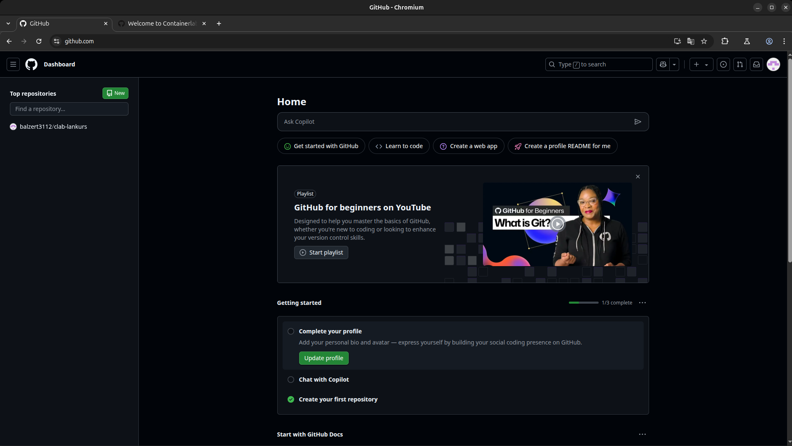
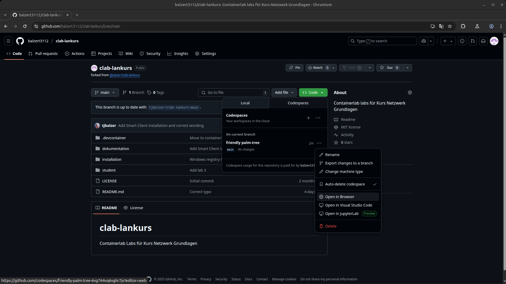
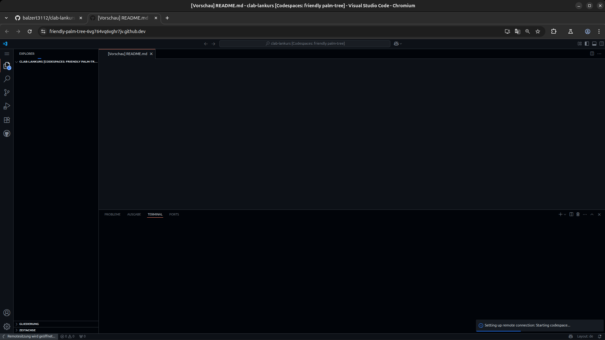
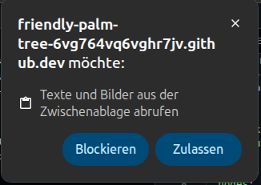
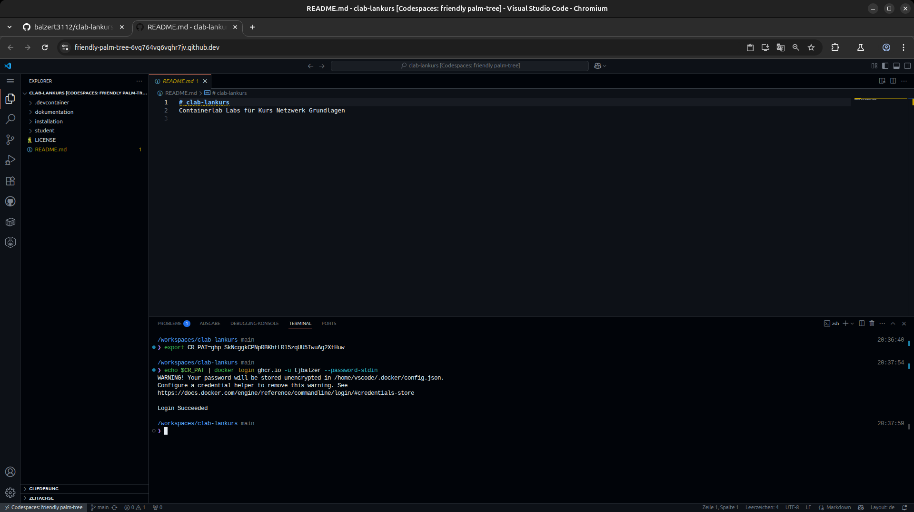

# Labs

## Lab 0 - Laborumgebung mit Containerlab

### Codespace im GitHub Repository _clab_lankurs_ starten

Mit eurem GitHub Account:

- Ansicht __clab-lankurs__ GitHub Repository öffnen
- Über grünen Button `<> Code` + Reiter `Codespaces` + `...-Menü im Bereich` `On current branch`den Eintrag `Open in Browser` auswählen
- Codespace mit Simulationsumgebung wird gestartet

??? note "Screenshots: _Start Codespace_"
    
    
    
    
    

!!! note
    Der Reiter _Welcome to Containerlab_ wird nicht benötigt und kann geschlossen werden (Tipp: Haken `Don't show this page again` setzen).

### Zugriff auf GitHub Docker Registry einrichten

!!! info
    Wenn im Verlauf der folgenden Schritte im Browser ein Dialog erscheint, der den Zugriff auf die Zwischenablage anfordert, bitte Zugriff erlauben:

    ??? info "Screenshot: Clipboard Dialog im Browser"
        

Bitte die folgende Schritte im Bereich `TERMINAL` des im Browser geöffneten Codespace eingeben:

- Environment-Variable mit Zugriffstoken setzen
```
export CR_PAT=<YOUR_TOKEN>
```
- Anmeldung an die GitHub Container Registry des GitHub-Users <USERNAME>
```
echo $CR_PAT | docker login ghcr.io -u <USERNAME> --password-stdin
```

??? info "Screenshot: _GitHub Docker Registry Login_"
    


!!! info
    Die benötigten Informationen für `<YOUR_TOKEN>` und `<USERNAME>` erhalten die Schulungsteilnehmerauf drei Wegen:
    1. per E-Mail (für Smart Client Nutzer)
    2. in einer Datei auf dem Desktop des Schulungs-PCs
    3. über den Kursleiter (Fallback, falls 1.+2. nicht verfügbar)   

### Containerlab Topology Dateien anzeigen und ändern

- `EXPLORER`-Ansicht auswählen (Dateistruktur wird angezeigt)
- Die Dateien zu den einzelnen Übungen liegen im Verzeichnis `student` (Lab 1 bis 10)
- Bitte Verzeichnis `student/lab-2/topology.clab.yml` auswählen (Datei wird als Reiter im Editor-Bereich geöffnet)

``` yaml title="student/lab-2/topology.clab.yml"
name: lab2 # (1) 

mgmt: # (2)
  network: lankurs # (3)
  ipv4-subnet: auto # (4)

topology: # (5)
  nodes: # (6)
    SW1: # (7)
      kind: cisco_iol # (8)
      image: ghcr.io/tjbalzer/cisco_iol:L2-17.15.01 # (9)
      type: L2 # (10)
      #startup-config: configs/sw1.cfg.partial # (11)
    SW2:
      kind: cisco_iol
      image: ghcr.io/tjbalzer/cisco_iol:L2-17.15.01
      type: L2
      #startup-config: configs/sw2.cfg.partial
    R1:
      kind: cisco_iol
      image: ghcr.io/tjbalzer/cisco_iol:17.15.01
      startup-config: configs/r1.cfg.partial
    PC1:
      kind: linux
      image: ghcr.io/srl-labs/network-multitool
      exec: # (12)
        - ip address add 192.168.11.11/24 dev eth1 # (13)
        - ip route add 192.168.0.0/16 via 192.168.11.1 dev eth1 # (14)
    PC2:
      kind: linux
      image: ghcr.io/srl-labs/network-multitool
      exec:
        - ip address add 192.168.11.12/24 dev eth1
        - ip route add 192.168.0.0/16 via 192.168.11.1 dev eth1
    PC3:
      kind: linux
      image: ghcr.io/srl-labs/network-multitool
      exec:
        - ip address add 192.168.12.11/24 dev eth1
        - ip route add 192.168.0.0/16 via 192.168.12.1 dev eth1
    PC4:
      kind: linux
      image: ghcr.io/srl-labs/network-multitool
      exec:
        - ip address add 192.168.12.12/24 dev eth1
        - ip route add 192.168.0.0/16 via 192.168.12.1 dev eth1

  links: # (15)
    - endpoints: ["SW1:e0/1", "R1:e0/1"] # (16)
    - endpoints: ["SW2:e0/1", "R1:e0/2"]
    - endpoints: ["SW1:e0/2", "PC1:eth1"]
    - endpoints: ["SW1:e0/3", "PC2:eth1"]
    - endpoints: ["SW2:e0/2", "PC3:eth1"]
    - endpoints: ["SW2:e0/3", "PC4:eth1"]
```

1. Name des Labors (ist Bestandteil des Gerätenames im Containerlab Labor)
2. Management-Sektion: Konfiguration des Management Netzes
3. Name des Management Netzwerks
4. IPv4 Adressbereich des Management Netzwerks (hier: automatische Vergabe)
5. Topology-Sektion: Beschreibung des Labornetzes (Netzwerk Nodes, verwendete Images, Konfiguration und Verbindungen)
6. Nodes-Sektion: Beschreibung der Nodes
7. Hostname des Nodes
8. Kind/Typ des Nodes (z.B. `cisco_iol` oder `linux`)
9. Name des zu verwendeten Container Image
10. Typ (für einige Node Kinds, z.B. `cisco_iol` zur Auswahl des Layer 2 oder Layer 3 Images)
11. Optionale Startkonfiguration für den Node (hier zur späteren Verwendung auskommentiert)
12. Exec-Bereich für Docker-Container zur Übergabe von Befehlen, die beim Start des Containers ausgeführt werden
13. Konfiguration IP-Adresse des Linux Containers
14. Konfiguration Default-Gateway des Linux Containers
15. Links-Sektion: Beschreibungd der Verbindungen zwischen den Containern
16. Verbindung der Endpunkte SW1 Interface e0/1 nach R1 Interface eth1

### Lab-2 starten

- Containerlab-Bereich auswählen (über Containerlab Symbol)
- Im Bereich `UNDEPLOYED LOCAL LABS` das Verzeichnis `student/lab-2` öffnen
- Rechtsklick auf Datei `topology.clab.yml` und Start des Labors über Menüeintrag `Deploy`
  * Fehlende Conatainer-Images werden aus der GitHub Docker Registry `ghcr.io` heruntergeladen und gespeichert
  * Labor Nodes werden gestartet und Verbindungen zwischen den Nodes etabliert
  * Node Status grün/Up wird im Bereich `RUNNING LABS` angezeigt


### Codespace im GitHub Repository _clab_lankurs_ stoppen

- Ansicht __clab-lankurs__ GitHub Repository öffnen
- Über grünen Button `<> Code` + Reiter `Codespaces` (Codespace wird als `Active` angezeigt) + `...`-Menü im Bereich `On current branch`den Eintrag `Stop codespace` auswählen
- Codespace mit Simulationsumgebung wird gestoppt

??? note "Screenshots: _Stopp Codespace_"
    
    
    

## Lab 1 - Containerlab & Wireshark

## Lab 2 - Hubs & Switches

## Lab 3 - Ethernet Frameformate 

## Lab 4 - Ethernet, ARP & IP Adressen

## Lab 5 - VLANs & statisches Routing

## Lab 6 - Dynamisches Routing

## Lab 7 - User Datagram Protokol (UDP)

## Lab 8 - Transmission Control Protocol (TCP)

## Lab 9 - Anwendungsprotokolle & Tools

## Lab 10 - Firewalls & Portscanning
