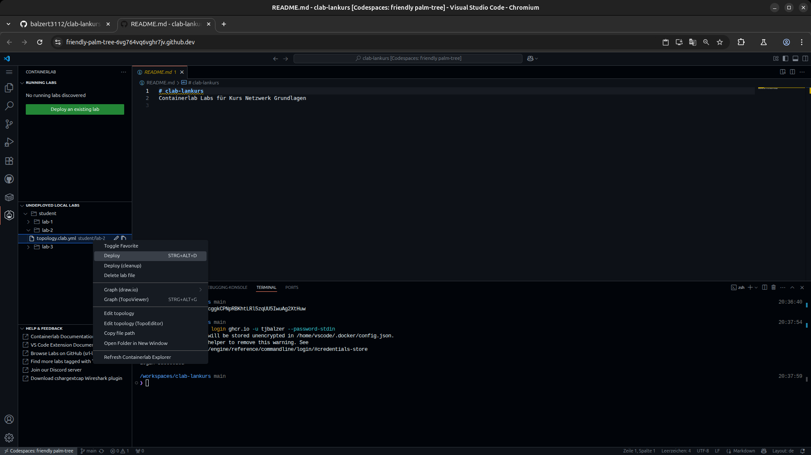
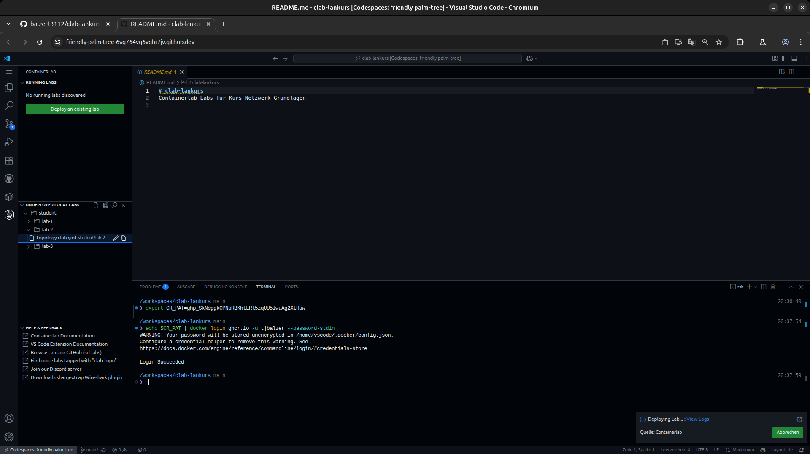
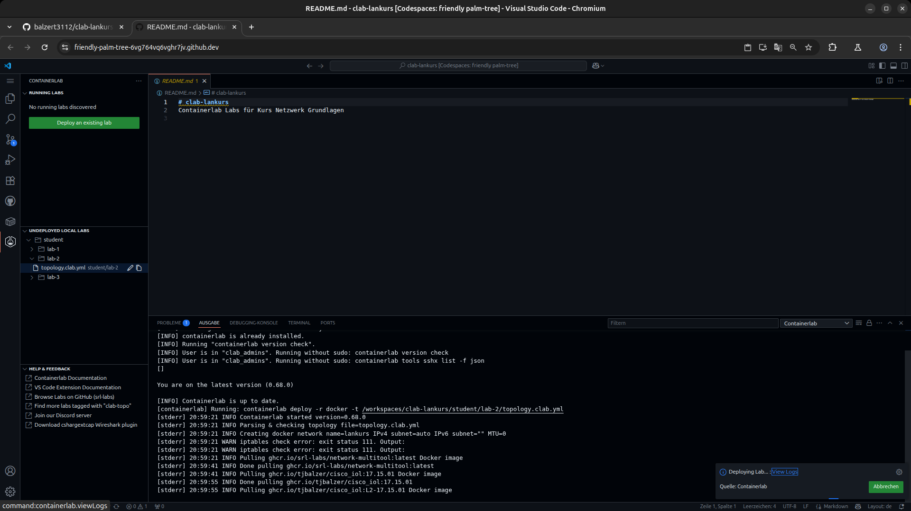
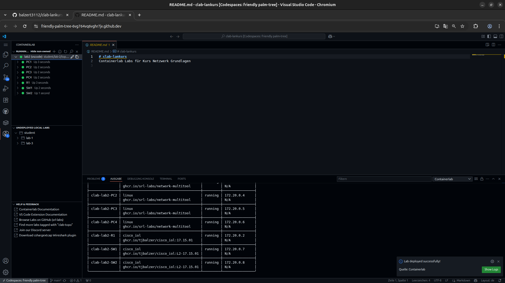
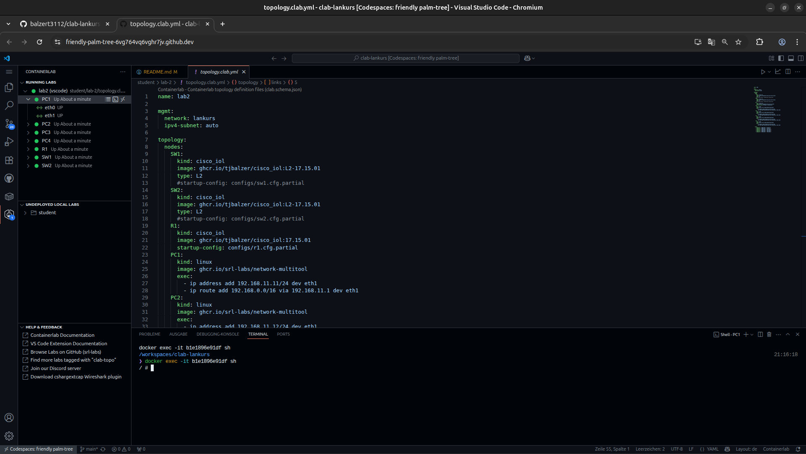
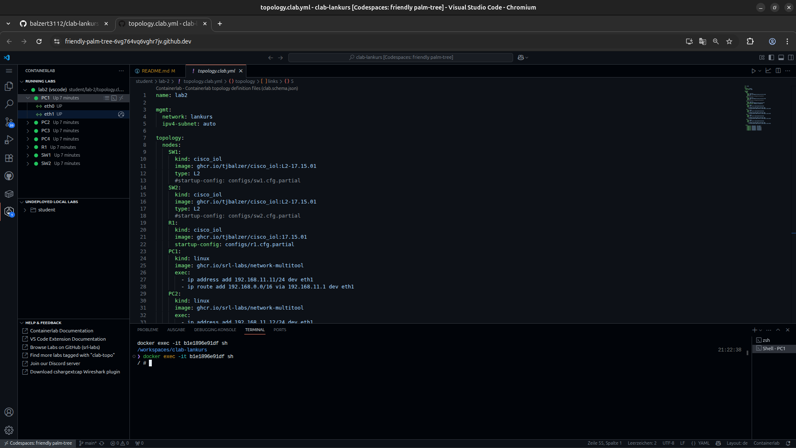
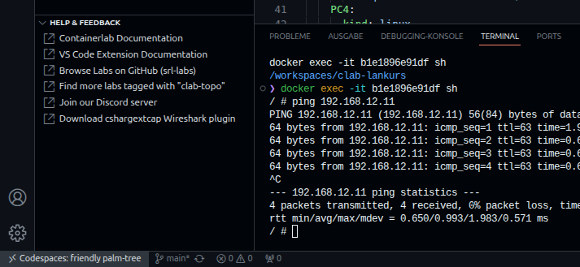
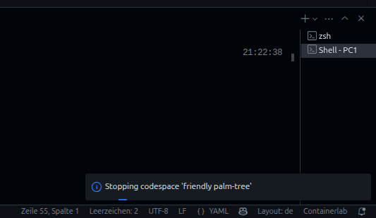
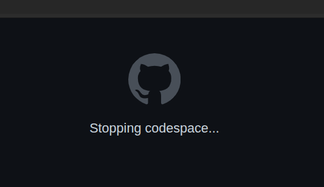
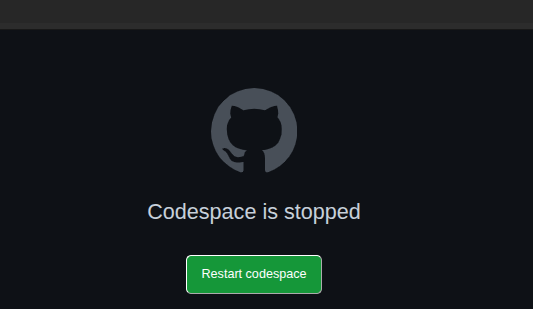

# Labs

## Lab 0 - Laborumgebung mit Containerlab

In dieser Übung wird gezeigt, wie der in den Vorbereitungen angelegte GitHub Codespace gestartet und gestoppt werden kann. 

Darüber hinaus wird das Basiswissen zum Umgang mit _Containerlab_ vermittelt:

- Anzeige und Aufbau der Containerlab Topology-Dateien
- Lab in Containerlab starten und stoppen
- Grafische Anzeige des in der Topology-Datei beschriebenen Labornetzwerkes mit Hilfe des eingebauten Topology Viewers
- Verbindung mit der Kommandzeile von PCs im Labornetzwerk
- Ausführen von Befehlen in der Kommandozeile eines Labornetz-PCs

  
  

/// caption
Lab Topology
///

### Codespace im GitHub Repository _clab_lankurs_ starten

Mit eurem GitHub Account:

- Ansicht __clab-lankurs__ GitHub Repository öffnen
- Über grünen Button `<> Code` + Reiter `Codespaces` + `...-Menü im Bereich` `On current branch`den Eintrag `Open in Browser` auswählen
- Codespace mit Simulationsumgebung wird gestartet

!!! note
    Die Steuerung der GitHub Codespace Simulationsumgebung mit Containerlab erfolgt durch eine Browserversion des [_Visual Studio Code Editors_](https://code.visualstudio.com/) von Microsoft. _VS Code_ wird mit entsprechenden Plugins durch die Aktivierung des GitHub Codespaces automatisch im lokalen Webbrower gestartet. Die Deteils der Steuerung der Simulationsumgebung über _VS Code_ werden im Verlauf der Übungen schrittweise vorgestellt.

!!! tip
    Sollten im Webbrowser Probleme mit der Steuerung der Simulationsumgebung auftreten oder Fehlermeldungen angezeigt werden, wurde ggf. die Verbindung zwischen Webbrowser und Codespace unterbrochen bzw. der Codespace unerwartet gestoppt. In diesen Fällen kann die Funktion meist wiederhergestellt werden, indem man den Seiteninhalt über den `Reload`-Button des Webbrowser erneut lädt.

??? info "Screenshots: _Start Codespace_"
    
    
    
    
    

!!! note
    Der Reiter _Welcome to Containerlab_ wird nicht benötigt und kann geschlossen werden (Tipp: Haken `Don't show this page again` setzen).

### Zugriff auf GitHub Docker Registry einrichten

Für die Funktion der Labornetzwerke müssen nach dem ersten Start des Codespaces einmalig beim Start des ersten Labors noch einige Docker-Images
aus einer zentralen GitHub Docker-Registry geladen werden. Um dies zu ermöglichen, muss der Zugang zu wie folgt eingerichtet werden:

!!! note
    Wenn im Verlauf der folgenden Schritte im Browser ein Dialog erscheint, der den Zugriff auf die Zwischenablage anfordert, bitte Zugriff erlauben:

    ??? info "Screenshot: Clipboard Dialog im Browser"
        

!!! info
    Die für die nächsten Schritte benötigten Informationen `<YOUR_TOKEN>` und `<USERNAME>` erhalten die Schulungsteilnehmerauf drei Wegen:

    1. per E-Mail (für Smart Client Nutzer)
    2. in einer Datei auf dem Desktop des Schulungs-PCs
    3. über den Kursleiter (Fallback, falls 1. + 2. nicht verfügbar)   

Bitte die folgende Schritte im Bereich `TERMINAL` des im Browser geöffneten Codespace eingeben:

- Environment-Variable mit Zugriffstoken setzen

```
export CR_PAT=<YOUR_TOKEN>
```
- Anmeldung an die GitHub Container Registry des GitHub-Users <USERNAME>
```
echo $CR_PAT | docker login ghcr.io -u <USERNAME> --password-stdin
```

??? info "Screenshot: _GitHub Docker Registry Login_"
    

### Containerlab Topology Dateien anzeigen und ändern

- `EXPLORER`-Ansicht auswählen (Dateistruktur wird angezeigt)
- Die Dateien zu den einzelnen Übungen liegen im Verzeichnis `student` (Lab 1 bis 10)
- Bitte Verzeichnis `student/lab-2/topology.clab.yml` auswählen (Datei wird als Reiter im Editor-Bereich geöffnet)
- Bei Bedarf kann das Labornetzwerk über diese Datei konfiguriert werden (wird ggf. in künftigen Labs benötigt)
- Erklärungstexte für die einzelnen Bereiche können im folgenden Listing durch einen Klick auf die :material-plus-circle:-Symbole angezeigt werden

  ``` yaml title="student/lab-2/topology.clab.yml"
  name: lab2 # (1) 

  mgmt: # (2)
    network: lankurs # (3)
    ipv4-subnet: auto # (4)

  topology: # (5)
    nodes: # (6)
      SW1: # (7)
        kind: cisco_iol # (8)
        image: ghcr.io/tjbalzer/cisco_iol:L2-17.15.01 # (9)
        type: L2 # (10)
        #startup-config: configs/sw1.cfg.partial # (11)
      SW2:
        kind: cisco_iol
        image: ghcr.io/tjbalzer/cisco_iol:L2-17.15.01
        type: L2
        #startup-config: configs/sw2.cfg.partial
      R1:
        kind: cisco_iol
        image: ghcr.io/tjbalzer/cisco_iol:17.15.01
        startup-config: configs/r1.cfg.partial
      PC1:
        kind: linux
        image: ghcr.io/srl-labs/network-multitool
        exec: # (12)
          - ip address add 192.168.11.11/24 dev eth1 # (13)
          - ip route add 192.168.0.0/16 via 192.168.11.1 dev eth1 # (14)
      PC2:
        kind: linux
        image: ghcr.io/srl-labs/network-multitool
        exec:
          - ip address add 192.168.11.12/24 dev eth1 # (15)
          - ip route add 192.168.0.0/16 via 192.168.11.1 dev eth1 # (16)
      PC3:
        kind: linux
        image: ghcr.io/srl-labs/network-multitool
        exec:
          - ip address add 192.168.12.11/24 dev eth1 # (17)
          - ip route add 192.168.0.0/16 via 192.168.12.1 dev eth1 # (18)
      PC4:
        kind: linux
        image: ghcr.io/srl-labs/network-multitool
        exec:
          - ip address add 192.168.12.12/24 dev eth1 # (19)
          - ip route add 192.168.0.0/16 via 192.168.12.1 dev eth1 # (20)

    links: # (21)
      - endpoints: ["SW1:e0/1", "R1:e0/1"] # (22)
      - endpoints: ["SW2:e0/1", "R1:e0/2"]
      - endpoints: ["SW1:e0/2", "PC1:eth1"]
      - endpoints: ["SW1:e0/3", "PC2:eth1"]
      - endpoints: ["SW2:e0/2", "PC3:eth1"]
      - endpoints: ["SW2:e0/3", "PC4:eth1"]
  ```

  1. Name des Labors (ist Bestandteil des Gerätenames im Containerlab Labor)
  2. Management-Sektion: Konfiguration des Management Netzes
  3. Name des Management Netzwerks
  4. IPv4 Adressbereich des Management Netzwerks (hier: automatische Vergabe)
  5. Topology-Sektion: Beschreibung des Labornetzes (Netzwerk Nodes, verwendete Images, Konfiguration und Verbindungen)
  6. Nodes-Sektion: Beschreibung der Nodes
  7. Hostname des Nodes
  8. Kind/Typ des Nodes (z.B. `cisco_iol` oder `linux`)
  9. Name des zu verwendeten Container Image
  10. Typ (für einige Node Kinds, z.B. `cisco_iol` zur Auswahl des Layer 2 oder Layer 3 Images)
  11. Optionale Startkonfiguration für den Node (hier zur späteren Verwendung auskommentiert)
  12. Exec-Bereich für Docker-Container zur Übergabe von Befehlen, die beim Start des Containers ausgeführt werden
  13. Konfiguration der IP-Adresse von PC1
  14. Konfiguration des Default-Gateways von PC1
  15. Konfiguration der IP-Adresse von PC2
  16. Konfiguration des Default-Gateways von PC2
  17. Konfiguration der IP-Adresse von PC3
  18. Konfiguration des Default-Gateways von PC3
  19. Konfiguration der IP-Adresse von PC4
  20. Konfiguration des Default-Gateways von PC4
  21. Links-Sektion: Beschreibungd der Verbindungen zwischen den Containern
  22. Verbindung der Endpunkte SW1 Interface e0/1 nach R1 Interface eth1

### Lab: Labornetzwerk starten

- Containerlab-Bereich auswählen (über Containerlab Symbol)
- Im Bereich `UNDEPLOYED LOCAL LABS` das Verzeichnis `student/lab-2` öffnen
- Rechtsklick auf Datei `topology.clab.yml` und Start des Labors über Menüeintrag `Deploy`
- Optional: Im Informations-Dialog unten rechts `View Logs` klicken:
    * Fehlende Conatainer-Images werden aus der GitHub Docker Registry `ghcr.io` heruntergeladen und gespeichert
    * Labor Nodes werden gestartet und Verbindungen zwischen den Nodes etabliert
    * Node Status wird farbig bzw. als `Up`/`Down` im Bereich `RUNNING LABS` angezeigt
    * Status der einzelen Nodes durch _aufklappen_ des Labs im Bereich `RUNNING LABS` angezeigt
- alternativ: ++ctrl+alt+d++

??? info "Screenshots: _Lab starten_"
    
    
    
    
    

### Lab: Topology Graph des Labornetzwerkes anzeigen

Eine grafische Übersicht kann z.B. über den eingebauten Topology Viewer angezeigt werden:

- Rechtsklick auf `lab2` im Bereich `RUNNING LABS`
- Im Kontextmenü `Graph (TopoViewer)`auswählen
- alternativ: ++ctrl+alt+g++

??? info "Screenshots: _Lab Topology Graph anzeigen_"
    
    

### Lab: Mit Kommandozeile eines PCs verbinden

Um eine Kommandozeile der PCs in einer Labor-Topologie zu öffnen gibt es drei Möglichkeiten:

Variante 1:

- Rechtsklick auf den Namen des gewünschten PCs (z.B. `PC1`) im Bereich `RUNNING LABS`
- Im Kontextmenü `Attach Shell` auswählen
- Im Bereich `TERMINAL` öffnet sich eine Shell (Kommandozeile) für den ausgeählten PC

??? note "Screenshots: _Variante 1_"
    
    

Variante 2:

- RechtAuswahl des gewünschten PCs (z.B. `PC1`) im Bereich `RUNNING LABS`
- Das mittlere der drei Symbole rechts neben dem PC auswählen 
- Im Bereich `TERMINAL` öffnet sich eine Shell (Kommandozeile) für den ausgeählten PC

??? note "Screenshots: _Variante 2_"
    
    

Variante 3:

- Symbol des PCs (z.B. PC3) in der TopoViewer-Ansicht auswählen
- Im Dialog `Actions` den Eintrag `Attach Shell`auswählen
- Im Bereich `TERMINAL` öffnet sich eine Shell (Kommandozeile) für den ausgeählten PC

??? info "Screenshots: _Variante 3_"
    
    

### Lab: Befehl auf Kommandozeile eines PCs ausführen

- Mit Kommandzeile von PC1 verbinden (siehe oben)
- Ping-Befehl für eine Prüfung der Verbindung zu PC3 eingeben:
    * `ping 192.168.12.11`
- Ping-Befehl mit ++ctrl+c++ abbrechen

??? info "Screenshot: _Ping-Befehl eingeben_"
    

### Codespace im GitHub Repository _clab_lankurs_ stoppen

Variante 1 (direkt auf GitHub):

- Ansicht __clab-lankurs__ GitHub Repository öffnen
- Über grünen Button `<> Code` + Reiter `Codespaces` (Codespace wird als `Active` angezeigt) + `...`-Menü im Bereich `On current branch`den Eintrag `Stop codespace` auswählen
- Codespace mit Simulationsumgebung wird gestoppt

??? info "Screenshots: _Stopp Codespace_"
    
    
    

Variante 2 (im Browser):

- Auf Fläche `>< Codespaces: <Name des Codespaces` unten links im Broswer klicken
- Im angezeigten Menü `Stop Current Codespace`auswählen
- Codespace mit Simulationsumgebung wird gestoppt

??? info "Screenshots: _Stopp Codespace_"
    
    
    
    
    

## Lab 1 - Containerlab & Wireshark

Der [Network Protocol Analyzer _Wireshark_](https://wireshark.org) ist die am meisten genutzte Software für die Netzwerk Paketanalyse. Wireshark ist ein Open Source Programm, das für private und kommerzielle Zwecke frei genutzt werden kann. Ein Network Protcol Analyzer kann Netzwerk Pakete aufzeichnen sowie die in den Paketen übertragenen Netzwerkprotokolle analysieren und unterstützt Netzwerkadminstratoren somit bei der Fehlersuche. Die Funktionen von Wireshark sind auch hervoragend geeignet, um den Aufbau von Netzwerkframes, -paketen und -segmenten sowie die Funktionsweise von Netzwerkprotokollen auf den verschieden Schichten des ISO/OSI Modells darzustellen, weshalb _Wireshark_ hervorragend für Ausbildungszwecke geeignet ist.

In dieser Übung gehen wir die ersten Schritte mit Wireshark. Hierzu arbeiten wir wieder mit Containerlab im GitHub Codespace, starten ein Labornetzwerk und zeichen mit Wireshark einen _Ping_ von PC1 nach PC3 auf.

!!! info
    Der _Ping-Befehl_ basiert auf dem _ICMP-Protokoll_, welches im Rahmen dieses Kurses zu einem späteren Zeitpunkt detailliert behandelt wird. Für den Moment soll genügen, dass der Ping-Befehl genutzt werden kann, um z.B. die Funktion einer Netzwerkverbindung zwischen zwei Endgeräten im Netzwerk zu überprüfen. Hierzu schickt ein Endgerät einen sog. _Ping-Request_ an ein anderes Endgerät im Netzwerk. Funktioniert die Netzwerkverbindung, erreicht der Ping-Request des ersten Endgeräts das zweite Endgerät und letzteres antwortet auf den empfangenen _Ping-Request_ mit einem _Ping-Reply_ an das erste Endgerät.

    Ein Ping, z.B. von PC1 nach PC3 wird auf der Kommandozeile von PC1 durch die Eingabe des Befehls `ping 192.168.12.11` gestartet, wobei `192.168.12.11` die IP-Adresse von PC3 darstellt, über welche PC3 für andere Endgeräte im Netzwerk erreichbar ist.


/// caption
Lab Topology
///

Die dafür notwendigen Schritte sind:

- GitHub Codespace starten
- Containerlab _Lab-2_ starten (Deploy)
- Mit Kommandozeile vn PC1 verbinden
- Ping-Befehl zwischen PC1 und PC3 starten
- Ping-Pakete zwischen PC1 und PC3 mit Wireshark aufzeichen
- Ping-Befehl stoppen
- Containerlab _Lab-2_ stoppen (Destroy)
- GitHub Codespace stoppen

!!! note
    Die notwendigen Vorgehensweisen zum Handling des Codspaces sowie das Starten und Stoppen von Containerlab Topologien wurden in _Lab 0_ vorgestellt und in dieser Übung als bekannt vorausgesetzt. Bei Bedarf bitte die Beschreibung im [Kapitel zu Lab 0](labs.md#lab-0-laborumgebung-mit-containerlab) als Referenz nutzen.

### GitHub Codespace und Lab-2 starten

GitHub Codespace und Containerlab Lab-2 analog der [Übung Lab 0](labs.md#lab-0-laborumgebung-mit-containerlab) starten.

### Lab: Edgeshark im GitHub Codespace starten

Wireshark läuft im Rahmen dieses Kurses auf lokalen Notebooks im Schulungsraum. Da unsere Labornetzwerke entfernt in einem GitHub Codespace in der Microsoft Azure Cloud laufen, müssen wir dafür sorgen, dass die entfernten Netzwerkpakete an die lokale Wireshark-Instanz geschickt werden. Hierzu wird auf der entfernten virtuellen Maschine (der GitHub Codespace) die Open Source Software [Edgeshark](https://edgeshark.siemens.io) in Form eines Docker Container gestartet.

Edgeshark liest die Netzwerkpakete auf den Verbindungen der einzelnen Netzwerkcontainer in unserer Lab-2 Containerlab Topolology und überträgt die Pakete an das `cshargextcap`-Plugin von Wireshark auf dem lokalen Schulungs-PC oder Smart Client (auf den SmartClients wurde das `cshargextcap`-Plugin während der Durchführung der Maßnahmen in der Sektion [Vorbereitungen](vorbereitungen.md) installiert.

_Edgeshark_ wird über die [_VS Code_](https://code.visualstudio.com/) _Command Palette_ wie folgt im GitHub Codespace gestartet:

- _VS Code Command Palette_ über ++ctrl+shift+p++ aufrufen
- `edgeshark` in der Eingabezeile der _VS Code Command Palette` eingeben
- Befehl `Containerlab: Instll Edgeshark` aus der Liste auswählen
- Edgeshark Container wird bei Bedarf aus dem Internet geladen, lokal gespeichert und gestartet
- Nach dem erfolgreichen Start von _Edgeshark_ können Paketaufzeichnungen gestartet und die aufgezeichneten Paket lokal in Wireshark angzeigt werden (Wireshark wird automatisch nach dem Start der Paketaufzeichnung im entfernten Containerlab Labor lokal gestartet)

??? info "Screenshots: _Edgeshark im GitHub Codespace starten_"
    
    
    

Der erfolgreiche Start kann bei Bedarf geprüft werden, indem man die _Edgeshark_ Startseite aufruft. Nach dem Start von _Edgeshark_ wird unten rechts im Webbrowser

### Lab-2 und GitHub Codespace stoppen

Containerlab Lab-2 und GitHub Codespace analog der [Übung Lab 0](labs.md#lab-0-laborumgebung-mit-containerlab) stoppen.

## Lab 2 - Hubs & Switches

## Lab 3 - Ethernet Frameformate 

## Lab 4 - Ethernet, ARP & IP Adressen

## Lab 5 - VLANs & statisches Routing

## Lab 6 - Dynamisches Routing

## Lab 7 - User Datagram Protokol (UDP)

## Lab 8 - Transmission Control Protocol (TCP)

## Lab 9 - Anwendungsprotokolle & Tools

## Lab 10 - Firewalls & Portscanning
