# Vorbereitungen für die Netzerksimulationen und Übungen

Die Übungen für den Netzwerk-Kurs werden über ein GitHub-Repository zur Verfügung gestellt. Mit Hilfe von virtualisierten _Cisco IOS Images_, welche in _Docker Containern_ ausgeführt werden, erfolgt die Simulation von Netzwerkgeräten (Router und Switches). Als Simulationsumgebung dient die Open Source Software [_Containerlab_](https://Github.com/hellt/containerlab) von Nokia, welche die Container orchestriert. Der Aufbau eines simulierten Netzwerkes wird in einer sogenannten Topology-Datei in YAML-Syntax beschrieben, welche _Containerlab_ beim Start eines Labs einliest und das Labor entsprechend einrichtet und konfiguriert.

Die Laborübungen ie Netzwerk-Simulationen laufen in sog. [Dev Containern](https://docs.github.com/en/codespaces/setting-up-your-project-for-codespaces/adding-a-dev-container-configuration/introduction-to-dev-containers) auf [GitHub Codespaces](https://docs.github.com/en/codespaces). _GitHub Codespaces_ sind virtuelle Maschinen, die auf GitHub gehostet werden und angepasst an die benötigte Systemumgebung in einem _GitHub Repository_ angelegt werden können. Ein kostenloser GitHub Account enthält derzeit (Juni 2025) monatlich 60 CPU-Stunden für die Nutzung von Codespace.

Um dies zu ermöglichen, benötigt jeder Kursteilnehmer einen eigenen GitHub-Account und eine Kopie (Fork) des entsprechenden GitHub-Repositories mit den [Netzwerkübungen](https://github.com/tjbalzer/clab-lankurs).

### GitHub Sign-up

!!! info
    Bereits bestehende GitHub-Accounts der Teilnehmer können ebenfalls genutzt werden. In diesem Fall weiter im Abschnitt [GitHub Sign-in](vorbereitungen.md#github-sign-in).

Ein GitHub Account wird wie folgt angelegt:

#### GitHub-Startseite in Webbrowser öffnen

[GitHub-Startseite](https://gigthub.com) in Webbrowser öffnen und Sign-up Button auswählen:

??? info "Screenshots: _GitHub Sign-up_"
    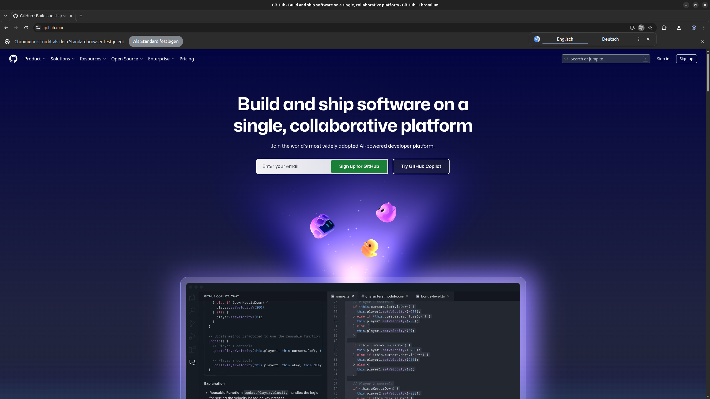
    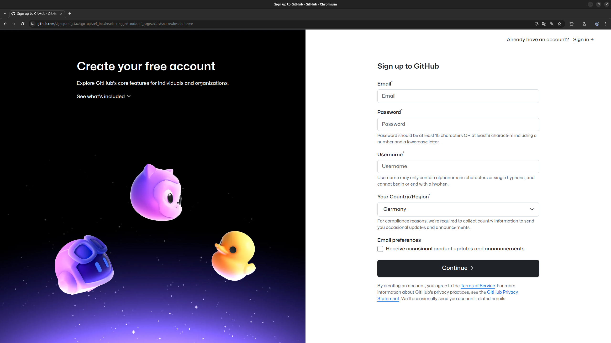

#### Benutzername und Passwort anlegen

- E-Mail Adresse eintragen
- Passwort eintragen und merken 🙂
- Gewünschten Usernamen eingeben (GitHub prüft Verfügbarkeit, Usernamen ggf. anpassen)
- Country/Region _Germany_ auswählen
- Button _Continue_ auswählen

??? info "Screenshot: _Beispiel Sign-up Dialog mit ausgefüllten Feldern_"
    

#### GitHub Account verifizieren

Der neue GitHub Account wird nun verifziert (hier am Beispiel _Bilderrätsel_ dargestellt):

- Button _Bilderrätsel_ auswählen
- Im rechten Bild angezeigte Grafik über rechts/links-Pfeile solange ändern, bis sie den im Text dargestellten Vorgaben entspricht
- Auswahl über den Button _Absenden_ bestätigen
- Bestätigungsnachricht wird angezeigt, wenn die Auswahl korrekt war, ansonsten wird ein neues Bilderrätsel angezeigt

??? info "Screenshots: _Account Verification_"
    
    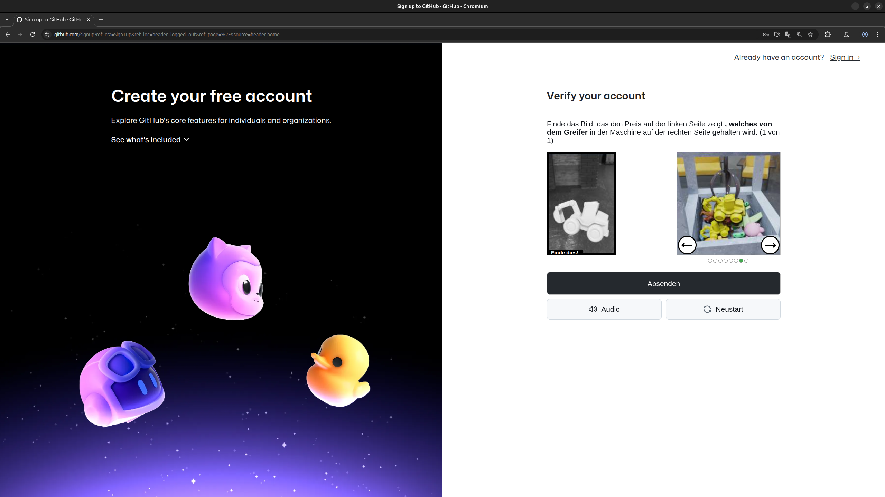
    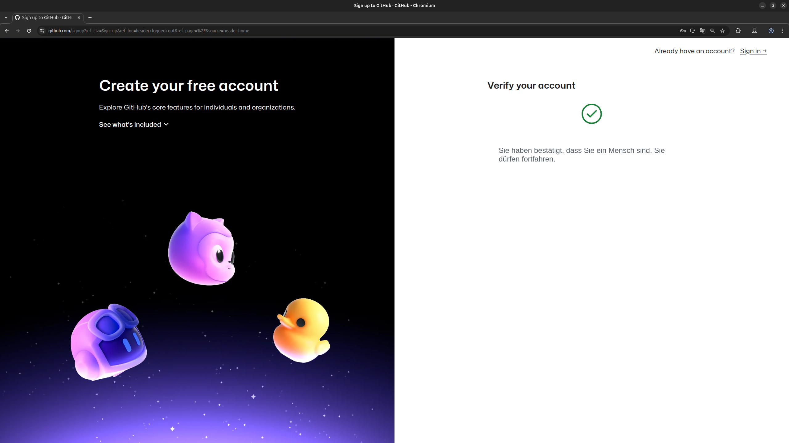

#### E-Mail Adresse bestätigen

Nach den Account Verifikation wird die E-Mail Adresse überprüft:

- Posteingang auf Nachricht von GitHub mit Bestätigungscode prüfen
- Bestätigungscode in den Feldern unter _Enter Code_ eintragen
- Eingabe über den Button _Continue_ abschließen (dadurch werden auch die GitHub _Terms of Service_ angenommen)
- Es folgt die Anzeige der GitHub Sign-in Seite

??? info "Screenshot: _E-Mail Adresse bestätigen_"
    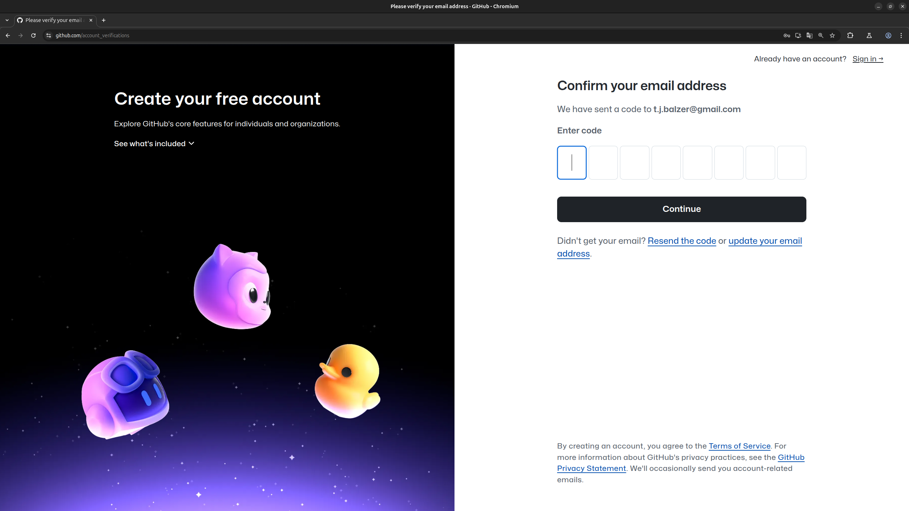
    

### GitHub Sign-in

Anmelden mit den Benutzerdaten des neu angelegten oder eines bereits bestehenden GitHub-Profils:

??? info "Screenshot: _Beispiel GitHub Sign-in_"
    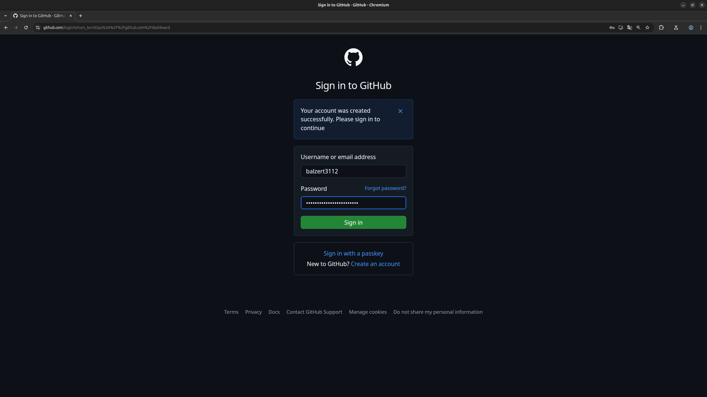
    

## _Forken_ des GitHub-Repositories für die Netzwerkübungen

Die Übungen werden über das GitHub Repository [clab-lankurs](https://github.com/tjbalzer/clab-lankurs) des GitHub Users _tjbalzer_ zur Verfügung gestellt. GitHub Codespaces werden einem GitHub-Repository zugeordnet und können nur vom Eigentümer des Repositories ausgeführt werden, wenn dieser mit seiner GitHub-Userid angemeldet ist. Deshalb muss das _clab-lankurs_ GitHub-Repository von der GitHub-Seite des GitHub-Nutzers _tjbalzer_ in das jeweilige GitHub-Konto jedes Kursteilnehmers kopiert (_geforkt_) werden.

Dieser _Fork_ des Original GitHub-Repositories wird wie folgt erstellt:

- Öffnen der GitHub-Webseite des _clab-lankurs_ Repositories: [https://github.com/tjbalzer/clab-lankurs](https://github.com/tjbalzer/clab-lankurs)
- Button _Fork_ auswählen, um das _clab-lankurs_ Repository als eigenes Repository in die GitHub-Umgebung des Nutzers zu kopieren
- Fork durch Bestätigung der Eingabemaske _Create a new fork_ über den Button _Create fork_ erstellen

??? info "Screenshot: _LAN-Kurs Repository forken_"
    
    
    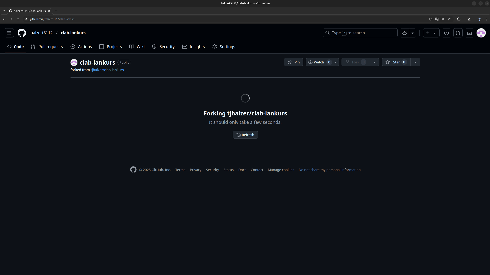
    


## Dev Container in GitHub Codespaces erstellen und starten

Die Netzwerk Labs sollen in einer virtuellen Maschine (VM) auf GitHub laufen. Die VM wird als [_Dev Container_](https://docs.github.com/en/codespaces/setting-up-your-project-for-codespaces/adding-a-dev-container-configuration/introduction-to-dev-containers) (auf GitHub auch [_Codespace_](https://docs.github.com/en/codespaces) genannt) definiert und erstellt. Das vereinfacht die zentrale Verwaltung, Aktualisierung und Verteilung der Simulationsumgebung und auf dem lokalen Rechner müssen - mit Ausnahme von Wireshark - keine Installationen vorgenommen werden. Der Dev Container ist im geforkten Repository in der Datei `.devcontainer/devocontainer.json` definiert und basiert auf einem [Containerlab Docker Container](https://containerlab.dev/manual/codespaces/) der SRL Labs:

``` JSON title="devcontainer.json"
{
    "image": "ghcr.io/srl-labs/containerlab/devcontainer-dind-slim:0.68.0", // (1)
    "hostRequirements": {
        "cpus": 2, // (2)
        "memory": "8gb", // (3)
        "storage": "32gb" // (4)
    }
}
```

1.  Definiert, welche Version des Containerlab Docker Containers verwendet werden soll
2.  Definiert die Anzahl der gewünschetn CPU Cores für die VM
3.  Definiert die Größe des RAM Speichers für die VM
4.  Definiert die Größe des Dateispeichers für die VM

Die Existenz der Datei `.devcontainer/devcontainer.json` im _clab-lankurs_ Repository wird von GitHub automatisch erkannt und wir können den Dev Container (Codespace) wie folgt erstellen:

- Auf der Hauptseite des geklonten Repositories _clab-lankurs_ den Button _<> Code_ auswählen
- Daraufin wird ein Dialog mit den Reitern _Local_ und _Codespaces_ angezeigt
- Auswahl des Reiters _Codespaces_ und Erstellung des Dev Containers über den Button _Create codespace on main_
- Die Erstellung des Codespaces dauert in der Regel 5-10 Minuten
- Über den Informationsdialog `Setting up remote connection` unten rechts kann durch klicken auf `Building codespace...` bei Bedarf das Log für den Aufbau im Bereich `TERMINAL` angezeigt und verfolgt werden
- Die Erstellung und der Start des Codepaces ist abgeschlossen, wenn unten links der Verbindungsstatus `>< Codespaces: <zufälliger Name des Codespaces>` angezeigt, im Hauptfenster die _Containerlab Willkommensnachricht_ erscheint und das Containerlab Symbol am linken Rand in der vertikalen Bedienleiste eingeblendet wird
- Codespace läuft und die Laborumgebung kann genutzt werden

!!! info
    Als _Default Idle Timeout_ für GitHub Codespaces sind 30 Minuten vorkonfiguriert. Nutzt man einen gestarteten Codespace für 30 Minuten nicht, wird der Codespace automatisch gestoppt.

!!! info
    Als _Default Retention Time_ für GitHub Codespaces sind 30 Tage vorkonfiguriert. Codespaces werden maximal 30 Tage nach der letzten Nutzung gelöscht.

!!! info
    Die Codepace-Einstellungen für seinen GitHub-Account erreicht man unter dem folgenden Link, wenn man bereits mit seinem Nutzernamen auf GitHub angemeldet ist: [https://github.com/settings/codespaces](https://github.com/settings/codespaces)

??? info "Screenshots: _Codespace erstellen_"
    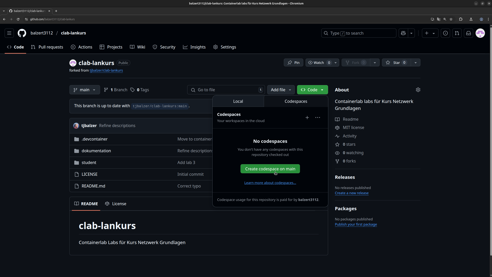
    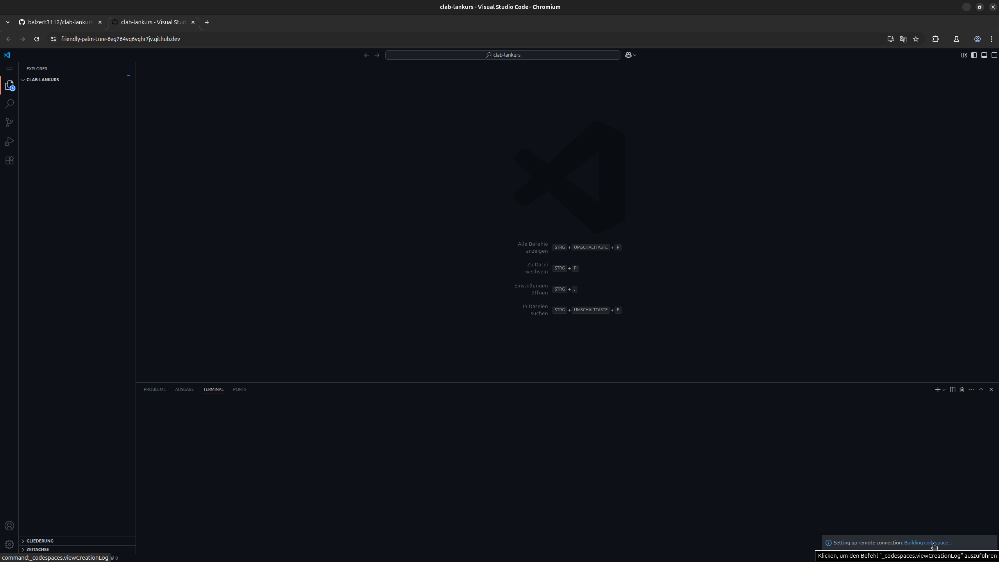
    
    
    
    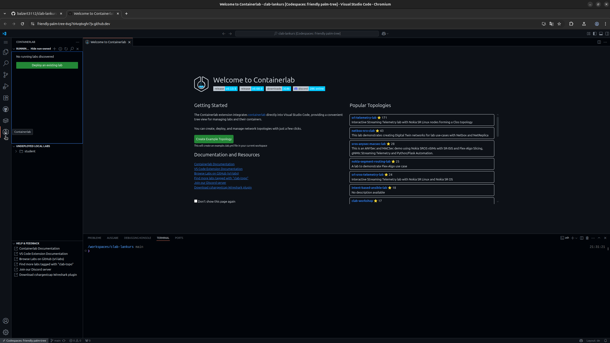

### Codespace Stoppen

- Ansicht __clab-lankurs__ GitHub Repository öffnen
- Über grünen Button `<> Code` + Reiter `Codespaces` (Codespace wird als `Active` angezeigt) + `...`-Menü im Bereich `On current branch`den Eintrag `Stop codespace` auswählen
- Codespace mit Simulationsumgebung wird gestoppt

??? info "Screenshots: _Stopp Codespace (GitHub)_"
    
    
    

## Softwareinstallation auf dem Smart Client 

Soll statt eines Schulungs-Notebooks der persönliche EnBW Smart Client genutzt werden, muss zusätzliche Software auf dem Smart Client installiert werden. Hierbei handelt es sich um die IDE [_Microsoft Visual Studio Code_](https://code.visualstudio.com) zur Steuerung der Laborumgebung, den Network Protocol Analyzer [_Wireshark_](https://www.wireshark.org) sowie ein Capture Plugin für Wireshark zu Unterstützung von Packet Captures über [_Edgeshark_](https://github.com/siemens/edgeshark). _Edgeshark_ ermöglicht es, mit _Wireshark_ den Netzwerkverkehr zwischen Docker Containern aufzuzeichnen, die auf dem lokalen Rechner oder entfernten Systemen ausgeführt werden.

### Installation von Microsoft VS Code

- [Download VS Code für Windows](https://code.visualstudio.com/Download) (Installationsdatei)
- Installationsdatei starten und _VS Code für Windows_ installieren (Adminrechte werden NICHT benötigt!)

??? info "Screenshots: _Microsoft VS Code installieren_"
    
    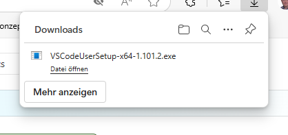
    
    
    
    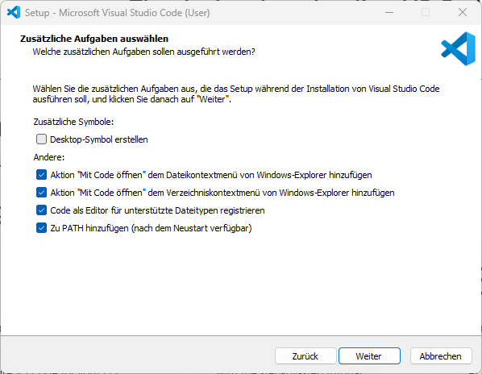
    
    
    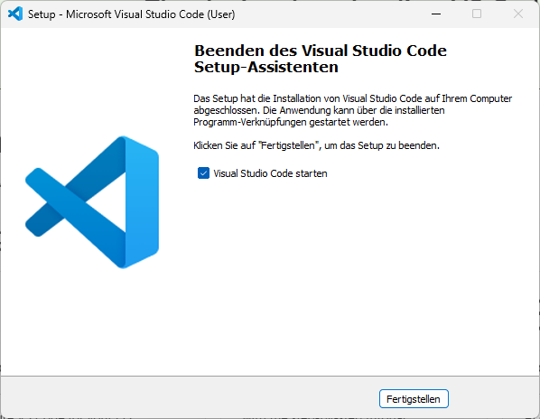
    

### Installation notwendiger VS Code Extensions

Damit die Laborumgebung des Kurses mit _VS Code_ gesteuert werden kann sowie der Zugriff auf die entfernt in einem GitHub Codespace laufende Laborumgebung funktioniert, müssen einige _VS Code Extensions_ installiert werden:

- [Containerlab Extension](https://marketplace.visualstudio.com/items?itemName=srl-labs.vscode-containerlab)
- [Remote Development Pack](https://marketplace.visualstudio.com/items?itemName=ms-vscode-remote.vscode-remote-extensionpack), bestehend aus:
    * [Remote - SSH](https://aka.ms/vscode-remote/download/ssh)
    * [Remote - Tunnels](https://marketplace.visualstudio.com/items?itemName=ms-vscode.remote-server)
    * [Dev Containers](https://aka.ms/vscode-remote/download/containers)
    * [WSL](https://aka.ms/vscode-remote/download/wsl)
- [GitHub Codespaces Extension](https://marketplace.visualstudio.com/items?itemName=GitHub.codespaces)

??? info "Screenshots: _VS Code Extensions installieren_"
    
    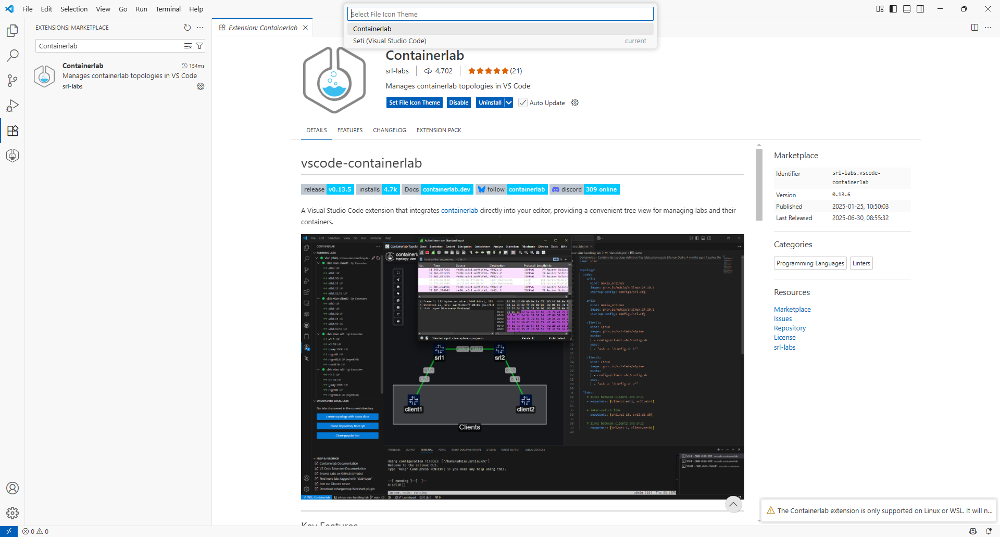
    
    
    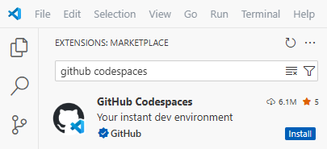
    
    

### Installation von __Wireshark__ & __Containershark Extcap Plugin for Wireshark__

!!! info
    Voraussetzung: Der Schulungsteilnehmer muss über Adminrechte auf dem Smart Client verfügen.

Übersicht über den Ablauf der Installation:

- [Wireshark Installer x64](https://2.na.dl.wireshark.org/win64/Wireshark-4.4.7-x64.exe) herunterladen
- Installationsdatei mit Adminrechten ausführen (Installation von Wireshark startet)
- [Containershark Extcap Plugin for Wireshark](https://github.com/siemens/cshargextcap/releases/download/v0.10.7/cshargextcap_0.10.7_windows_amd64.zip) herunterladen
- ZIP-Datei `cshargextcap_0.10.7_windows_amd64.zip` in ein Verzeichnis entpacken
- Die Datei `cshargextcap-amd64-installer.exe` im cshargextcap-Verzeichnis kopieren und in das Verzeichnis C:\Temp einfügen
- Die Datei `C:\Temp\cshargextcap-amd64-installer.exe` mit Adminrechten ausführen (Installation von cshargextcap startet) 
- [Datei mit Registry Keys](https://github.com/tjbalzer/clab-lankurs/blob/main/installation/cshargextcap.zip) aus dem clab-lankurs GitHub Repository herunterladen, ZIP-Datei öffnen und Datei `cshargextcap.reg` per Doppelklick mit der Maus in die Windows Registry importieren

Diese Schritte sind im Folgenden mit Screenshots der Details dargestellt:

#### Installation __Wireshark__ 

- [Wireshark Installer x64](https://2.na.dl.wireshark.org/win64/Wireshark-4.4.7-x64.exe) herunterladen
- Installationsdatei mit Adminrechten ausführen (Installation von Wireshark startet)

??? info "Screenshots: Wireshark Installation"
    
    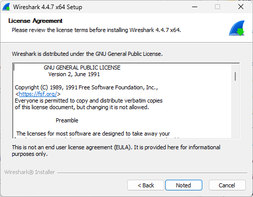
    
    
    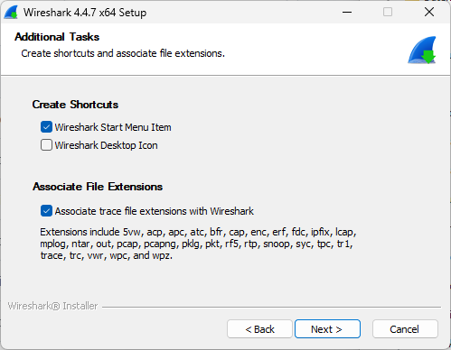
    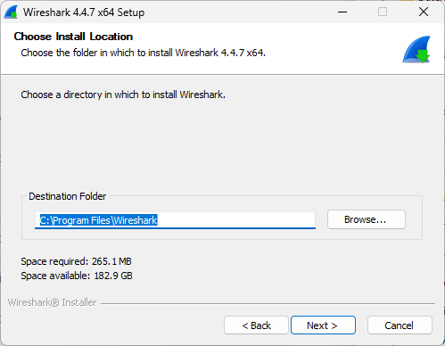
    
    
    
    
    
    
    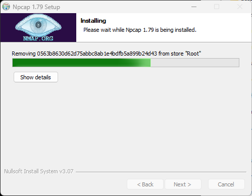
    
    
    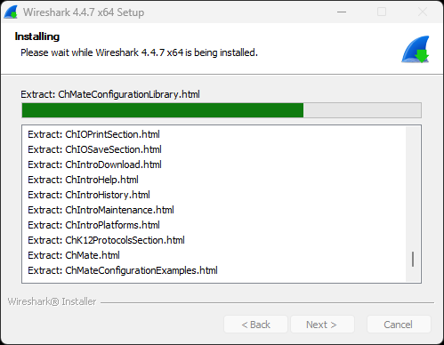
    
    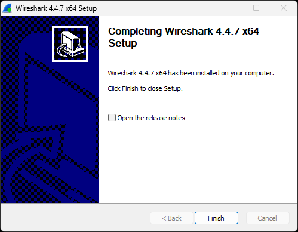

#### Installation __Containershark Extcap Plugins for Wireshark__

- [Containershark Extcap Plugin for Wireshark](https://github.com/siemens/cshargextcap/releases/download/v0.10.7/cshargextcap_0.10.7_windows_amd64.zip) herunterladen
- ZIP-Datei `cshargextcap_0.10.7_windows_amd64.zip` in ein Verzeichnis entpacken
- Die im ZIP-Archiv enthaltene Datei `cshargextcap-amd64-installer.exe` im Zielverzeichnis `cshargextcap_0.10.7_windows_amd64` kopieren und in das Verzeichnis `C:\Temp` einfügen
- Die Datei `C:\Temp\cshargextcap-amd64-installer.exe` mit Adminrechten ausführen (Installation von cshargextcap startet) 

??? info "Screenshots: Containershark Extcap Plugin Installation"
    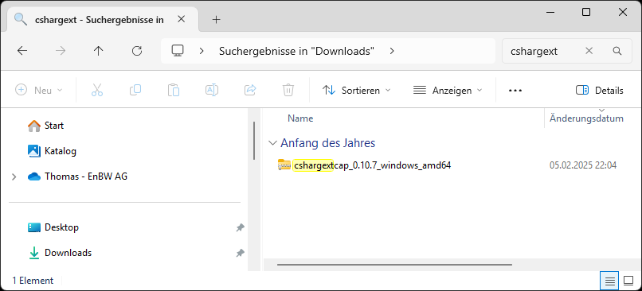
    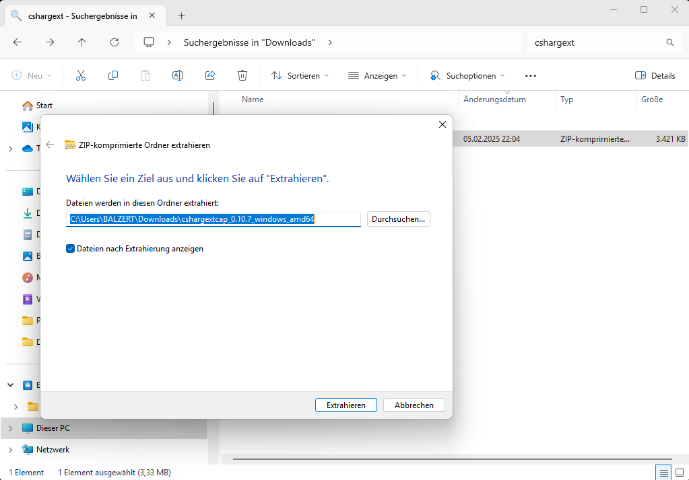
    
    
    
    
    
    
    

#### Import der Registry Keys für __Containershark Extcap Plugin for Wireshark__

!!! info
    Während der Installation des _Containershark Extcap Plugins for Wireshark_ werden wichtige Keys für die Funktion des Wireshark Plugins in die Registry eingetragen. Da das Setup-Programm die Registry Keys in die Registry Sektion  `HKEY_CURRENT_USER` einträgt und die Installation mit Adminrechten erfolgt, werden diese Einträge nicht im korrekten Userkontext vorgenommen. Daher ist es wichtig, die Registry Keys nach Abschluss der Installation nochmals zu importieren.

- [Datei mit Registry Keys](https://github.com/tjbalzer/clab-lankurs/blob/main/installation/cshargextcap.zip) aus dem clab-lankurs GitHub Repository über den Button 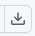 herunterladen
- Heruntergeladene ZIP-Datei `cshargextcap.zip` über Doppelklick öffnen und enthaltene Datei `cshargextcap.reg` per Doppelklick in die Windows Registry importieren

??? info "Screenshots: Import der Registry Keys für Containershark Extcap Plugin"
    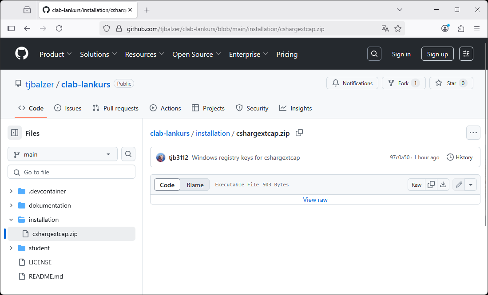
    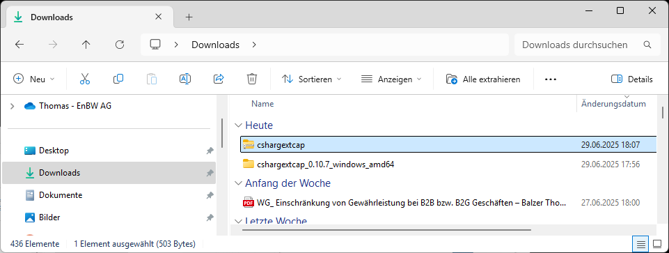
    
    
    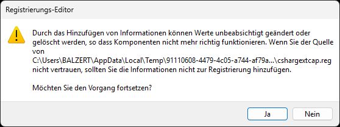
    
